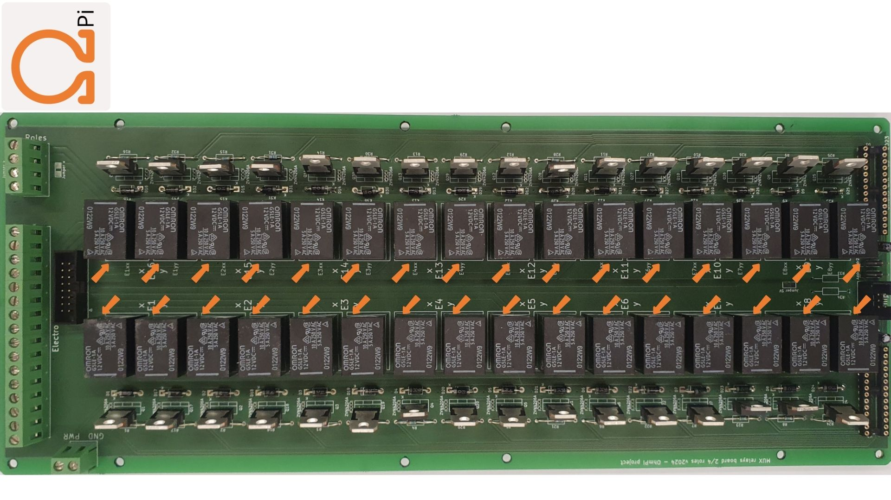
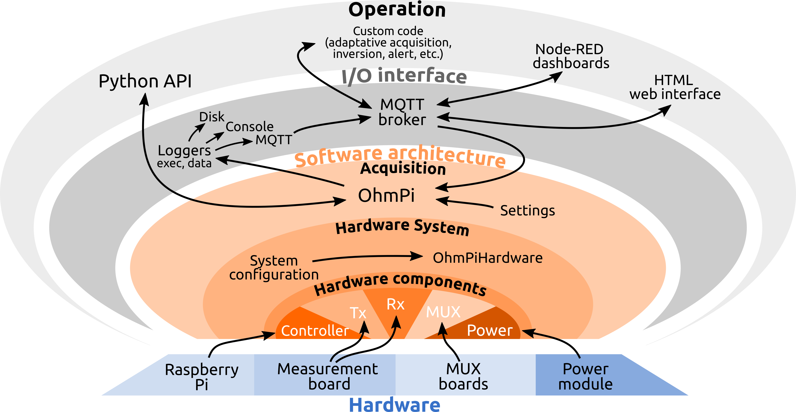

# OhmPi

Development of a low-cost multi-electrodes resistivity meter for electrical resistivity mesaurement for lab applications, based on raspberry board.

Join the community on [Discord](https://discord.gg/2SCKQZBzXh) to share your experience and provide feedback or use the gitlab issue.

## Installation

1. Download a .zip of this repository (or use `git clone https://gitlab.com/ohmpi/ohmpi.git`)
2. Enter the repository (`cd path/to/ohmpi`) and install the software needed. We made a simple script to make it simpler:

`./install.sh`

The installation script will create a virtual python environement `ohmpy` (with a 'y' at the end) where all packages specified in *requirements.txt* will be installed. The script also takes care of creating a configuration for your hardware if you wish.

To activate the environment and set the necessary `$PYTHONPATH` variable, you can use:

`source env.sh`

More examples are provided in the **[documentation](https://ohmpi.gitlab.io/ohmpi/)**.

## Gallery

A few pictures of the components of the OhmPi. More in the [**DOCUMENTATION**](https://ohmpi.gitlab.io/ohmpi/)!

*Measurement board (v2024).*

*Multiplexer board (v2024).*

*Software architecture.*

## How to contribute

You can contribute to the code of OhmPi directly in this repository by raising issue or making merge request. We use different branches to manage different readiness level of the code:
- `XXX_issue` (e.g. `240_issue`) is a branch linked to an issue number to develop a new feature or fix a bug.
- `alpha`: experimental version of the code to be tested by core developers, this branch contains the latest changes but is **unstable**.
- `beta`: **testing** version, more stable than `alpha` that can be tried out by contributors to provide feedback to core developpers (released in winter). 
- `rc`: **release candidate** branch, version to be extensively tested before being released and merged into the `master` branch (released in spring).
- `master`: more **stable** version of the code. Bug fixes can be merged directly to master.

You can also contribute to the **documentation** (on the `docs` branch) by improving the documentation or showcasing your OhmPi application.

## Citing Ohmpi

If you use OhmPi for you work, please cite [this paper](https://www.sciencedirect.com/science/article/pii/S2468067220300316) as:

    Rémi Clement, Yannick Fargier, Vivien Dubois, Julien Gance, Emile Gros, Nicolas Forquet, OhmPi: An open source data logger for 
    dedicated applications of electrical resistivity imaging at the small and laboratory scale, HardwareX, Volume 8, 2020, e00122, ISSN 2468-0672, https://doi.org/10.1016/j.ohx.2020.e00122..

## License information

You may redistribute and modify this documentation and make products using it under the terms of the CERN-OHL-P v2 (https://cern.ch/cern-ohl). This documentation is distributed WITHOUT ANY EXPRESS OR IMPLIED WARRANTY, INCLUDING OF MERCHANTABILITY, SATISFACTORY QUALITY AND FITNESS FOR A PARTICULAR PURPOSE. Please see the CERN-OHL-P v2 for applicable conditions
