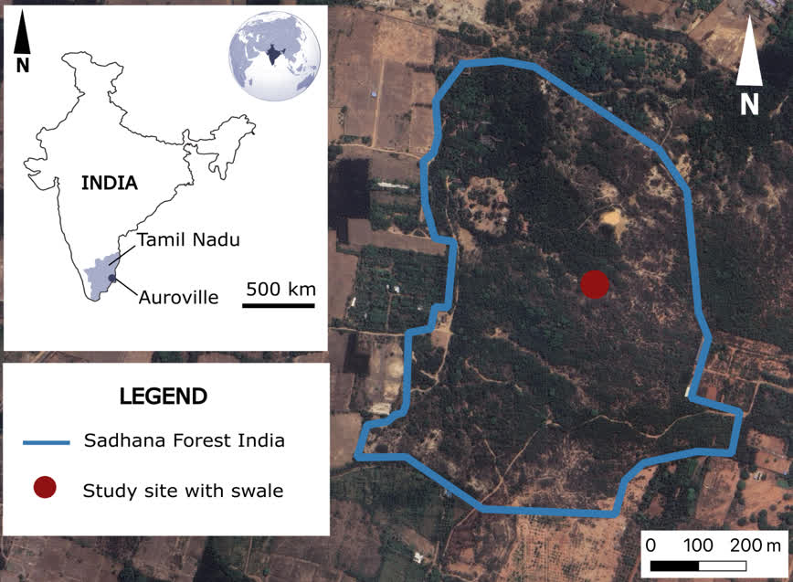
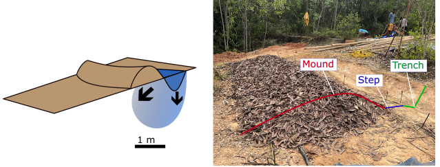
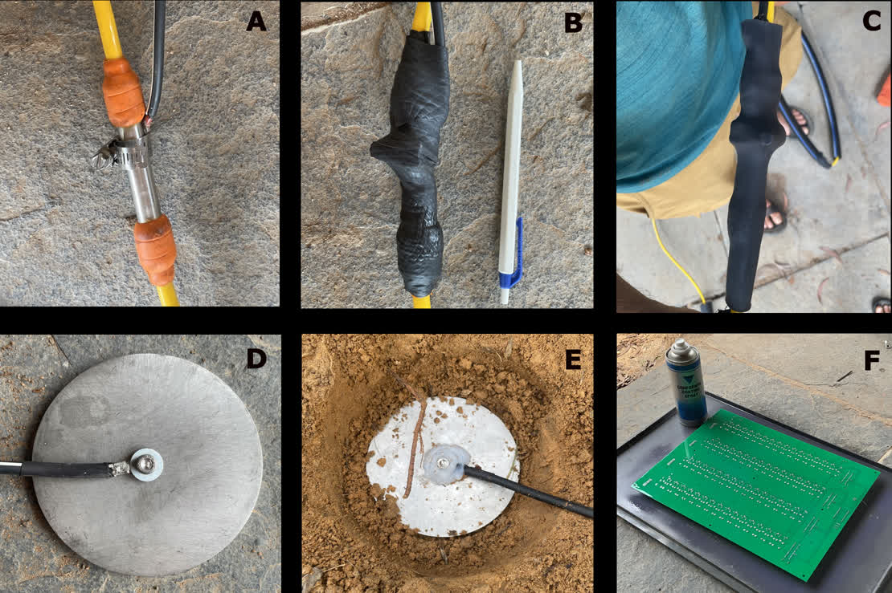
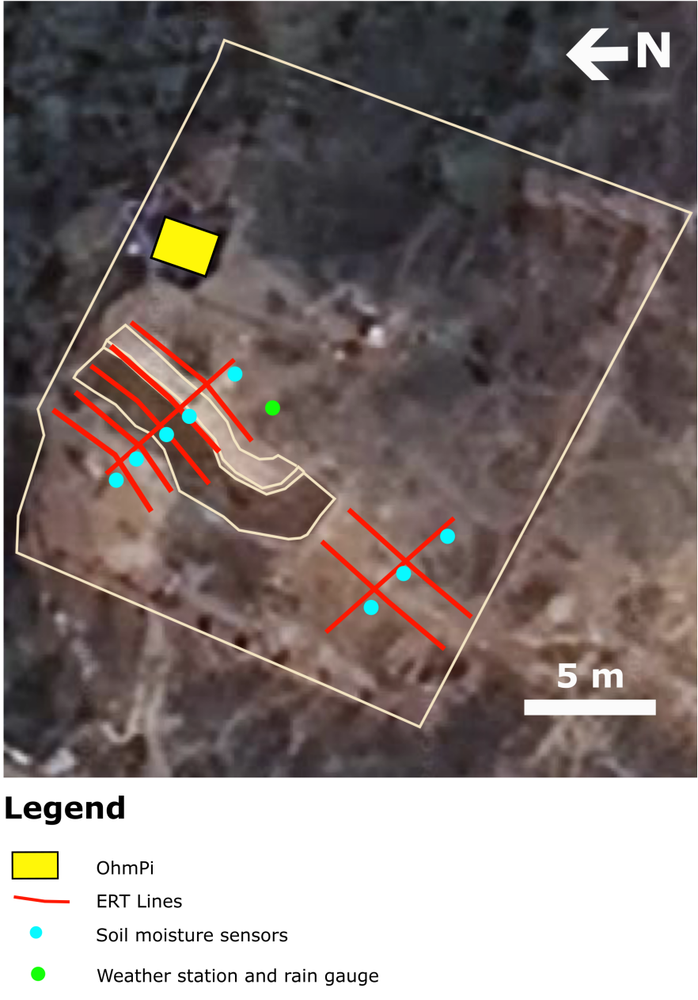
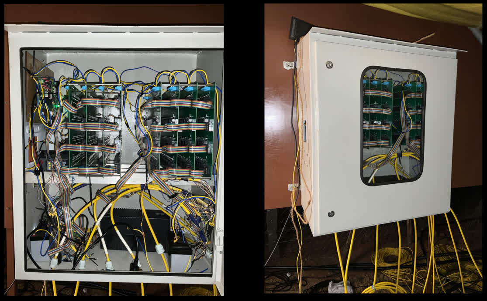
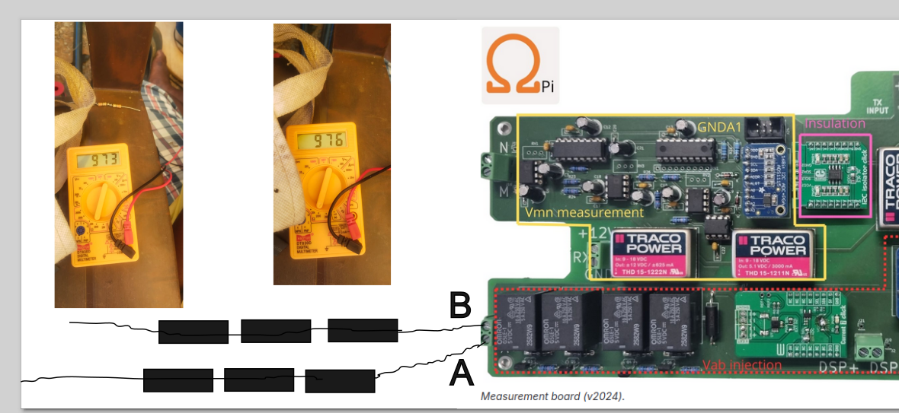

Groundwater recharge and sustainable extraction through resilient forest communities
====================================================================================

Introduction
------------

In the following we describe our experience with instrumenting an OhmPi in Tamil Nadu, India. The OhmPi was installed to monitor an on-contour swale, a water retention structure used for rainwater retention and to enhance infiltration in Sadhana Forest, India (`SFI <https://sadhanaforest.org/>`_). This deployment made possible through the project "Groundwater recharge and sustainable extraction through resilient forest communities", awarded by Geoscientists Without Borders (`GWB <https://seg.org/programs/geoscientists-without-borders/>`_) through the support of the Society of Exploration Geophysics (SEG). The deployment took place in May of 2024 during a period of 3 week,s and with the help of many volunteers and remote help from the OhmPi team (in particular Guillaume Blanchy and Arnaud Watlet). Much of the work presented here results from the Master thesis of Neomi Widmer (ETH Zurich). We describe the site, methodology and challenges in more detail below.

Sadhana Forest India
~~~~~~~~~~~~~~~~~~~~
Sadhana Forest is a non-for-profit organisation that focuses on water conservation, reforestation and community building practises. In India, near the town of Auroville, Sadhana Forest has been active since 2003 and has managed to reforest 46 hectares of severely eroded land with indigenous tree species, as well as exponentially increasing the water that is kept on the land from precipitation. Tp accomplish this they construct low-cost, small-scale methods such as check dams, gabions, and on-contour swales.

   
   Map-view of India with the location of Tamil Nadu and Auroville. The image (taken from Google Maps, 2024) shows the perimeter of the Sadhana Forest India community and the location of the study site within.

On-contour Swale
~~~~~~~~~~~~~~~~
An on-contour swale comprises two primary components: a dug trench and an artificially heaped area referred to as a mound or hump. The swale is constructed along contour lines and is suitable for slope gradients between 1.5% and 6%. The primary purpose of an on-contour swale is to slow down water runoff on the slope, store it in the trench, and facilitate infiltration into the soil, thereby enhancing soil moisture available for plants. Water that is captured in the trench infiltrates both vertically and horizontally, increasing soil moisture through enhanced infiltration.

   
   (left) Schematic of the principle of an on-contour swale, showing the relative dimensions and preferential water flow. (right) Picture of the swale constructed on the site, and later instrumented with electrodes and soil moisture sensors. Figures taken from Neomi Widmer (2024, MSc thesis, ETH Zurich).

Upfront Challenges
~~~~~~~~~~~~~~~~~~

-Sending equipment to India: We had to deal with customs as we were sending newly constructed (OhmPi) and used (cables) equipment. The solution was to donate this equipment to NGRI, our project partners.

-Weather: We knew upfront that we would have to deal with *extreme* weather, meaning high (sometimes 80%) humidity and temperature (up to 50 degrees in the shade). Also, the site is exposed to heavy winds with dust/sand likely to settle on the Components and boards.We therefore used protective sprays to cover the MUX and measurement boards.

Electrode and cable preparation
~~~~~~~~~~~~~~~~~~~~~~~~~~~~~~~

   
   Equipment: (A) the mechanical clamp used to attach a cable to the take-out of the main electrode line. (B) The take-out is sealed with self-healing waterproof tape. (C) The whole system is skink-tubed in place. (D) The plate electrodes, 10 cm in diameter, used for the installation. (E) Burying the electrodes ~10 cm in the soil. (F) Protective spray used to cover MUX and measurement boards, for resistance against heat, humidity and dust.

Deployment
~~~~~~~~~~

Talk about installation on the swale site and control.

   
   Topview figure of the site, taken from Google maps, showing the location of the electrical resistivity lines on the swale and control sites, the location of the soil moisture sensors and weather station, as well as the location of the OhmPi.

   
   Pictures of the box used to host the Ohmpi, also showing the internal setup.

Include schematic of how the ohmpi is connected (+ batteries, UPS, WIFI, etc)

OhmPi installation
~~~~~~~~~~~~~~~~~~

Outline the steps for deploying the OhmPi in the field, such as:

1. Transporting equipment and setting up at the field site.
2. Detailed steps for deploying equipment.
3. Monitoring and adjusting as necessary.

Consider including any images, diagrams, or code snippets that help explain the process.

Data Acquisition and Remote Access
~~~~~~~~~~~~~~~~~~~~~~~~~~~~~~~~~~

In this subsection we cover a few topics, including how we managed to connect remotely to the OhmPi (from Switzerland to India), to run measurements in time-lapse mode, and to ensure that data backup takes place regularly.

Connecting Remotely
^^^^^^^^^^^^^^^^^^^

Two possibilities used in this project:
1. Using Raspberry Pi Connect, only for Pi4 and up.
2. Using (NordVPN) VPN and SSH

Time-Lapse Measurements
^^^^^^^^^^^^^^^^^^^^^^^

Running reccurent measurements was possible through cron. 
Explain and give example bash script

Data Backup
^^^^^^^^^^^

Connection to Google Drive and daily uploads (explain, give example script)

Challenges
----------

Discuss the main challenges encountered during the project. This section could include:

- Technical obstacles (e.g., limitations in equipment, software issues)
- Environmental factors (e.g., weather conditions, geographical limitations)
- Logistical concerns (e.g., transportation, time constraints)

.. figure:: ../../img/images_india/ohmpi/charging_problem.png
   :width: 50%
   :align: center
   
   Caption missing.
   

   
   Caption missing.

Lessons learned
---------------

More here soon

Current Status
--------------

More here soon

Project participants
--------------------

- `Alexis Shakas <https://eeg.ethz.ch/the-group/people/person-detail.MTg1Nzkz.TGlzdC8xMjg1LC0xMzk4MzY5ODk1.html>`_ – Project Lead
- Neomi Widmer – MSc student
- `Mike Rowley <https://www.geo.uzh.ch/en/units/2b/staff/mikerowley.html>`_ – Project collaborator
- `Aviram Rozin <https://www.linkedin.com/in/aviramrozin/>`_ – Lead Sadhana Forest India
- `Tanvi Arora <https://www.researchgate.net/profile/Tanvi-Arora-2>`_ – Project collaborator

Acknowledgments
---------------

A big thank you to Neomi Widmer for carrying out the fieldwork and relentlessly struggling to get things working during her thesis, to Aviram Rozin for all his support and encouragement during the whole phase of the project, to Mike Rowley for all his help during the field campaign and for digging out the soil pits like a beast, to Pavan and Mani, and all the Sadhana Forest volunteers for all ther support from 6 am to often 11 pm, day in and day out. This project was made possible through the GWB-SEG grant #202301041.

