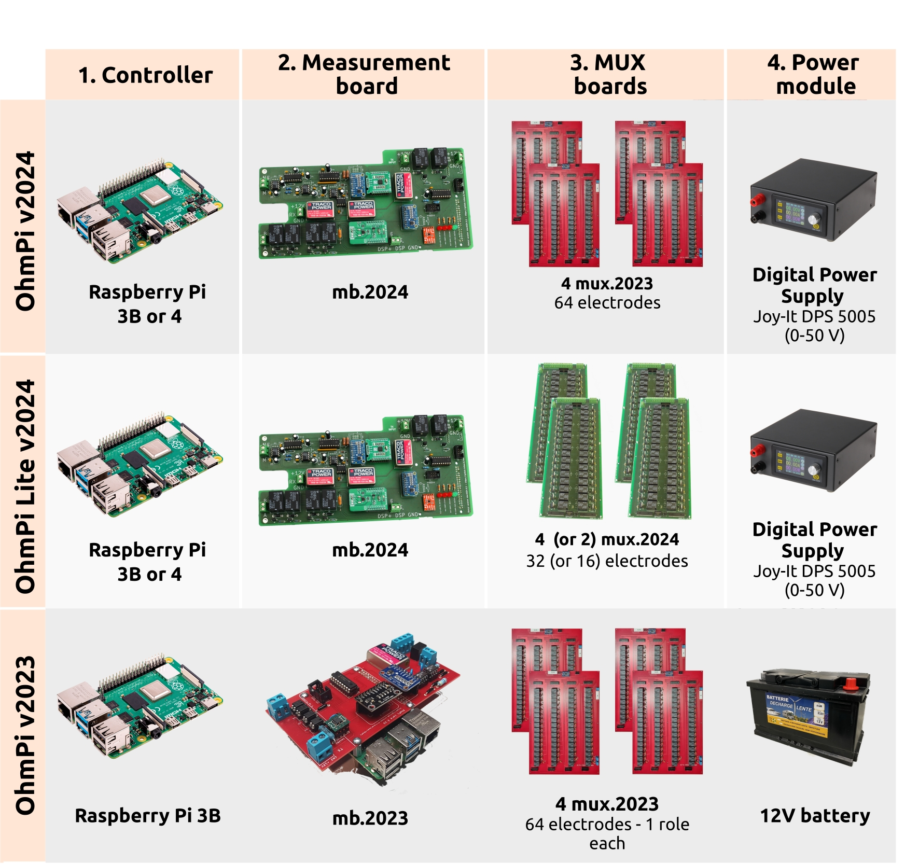

.. warning::
    **OhmPi is a participative project open to all, it requires skills in electronics and to respect the safety rules. OhmPi must be assembled in a professional context and by people competent in electronics. The OhmPi team cannot be held responsible for any material or human damage which would be associated with the use or the assembly of OHMPI. The OhmPi team cannot be held responsible if the equipment does not work after assembly.**

*******************************************
Build your Ohmpi 
*******************************************

In previous sections, we described the various components that compose Ohmpi.
Today, version 1.0x is no longer maintained, but all boards from v2023 upwards are compatible with each other. This is the major innovation of 2024.
Depending on your needs and applications, you can choose the board you are going to use.

Recommanded configurations
******************************

+-------------------------------+--------------------------------+--------------------+--------------------------+--------------------------+--------------------------------------------------+
|Applications                   |Measurement Board               |Mux                 |Raspberry Pi              | Power supply             |Config file name                                  |
+-------------------------------+--------------------------------+--------------------+--------------------------+--------------------------+--------------------------------------------------+
| | 64 or more electrodes       |mb v2024                        |Mux v2023           | | Raspberry Pi 3 Model B | DPS5005                  | config_mb_2024_0_2__4_mux_2023_dps5005.py        |
| | for field monitoring        |                                |                    | | or 4 model B           |                          |                                                  |
+-------------------------------+--------------------------------+--------------------+--------------------------+--------------------------+--------------------------------------------------+
| | 8, 16, 32, 48 electrodes    |mb v2024                        |Mux v2024           | | Raspberry Pi 3 Model B | DPS5005                  | config_mb_2024_0_2__4_mux_2024_2roles_dps5005.py |
| | for field monitoring        |                                |                    | | or 4 model B           |                          |                                                  |
+-------------------------------+--------------------------------+--------------------+--------------------------+--------------------------+--------------------------------------------------+
| | 8, 16, 32, 48 electrodes    |mb v2024                        |Mux v2024           | | Raspberry Pi 3 Model B | 12V Battery              | config_mb_2024_0_2__4_mux_2024_2roles.py         |
| | for laboratory monitoring   |                                |                    | | or 4 model B           |                          |                                                  |
+-------------------------------+--------------------------------+--------------------+--------------------------+--------------------------+--------------------------------------------------+
| | 4 electrodes concrete sample|mb v2024                        |None                |Raspberry Pi 3 Model B    | DPS5005                  | config_mb_2024_0_2_dps5005.py                    |
| | Laboratory (Rhoa and IP)    |                                |                    |                          |                          |                                                  |
+-------------------------------+--------------------------------+--------------------+--------------------------+--------------------------+--------------------------------------------------+
| | 4 electrodes soil sample    |mb v2024                        |None                |Raspberry Pi 3 Model B    | 12V Battery              | config_mb_2024_0_2.py.                           |
| | laboratory (Rhoa and IP)    |                                |                    |                          |                          |                                                  |
+-------------------------------+--------------------------------+--------------------+--------------------------+--------------------------+--------------------------------------------------+
| | 4 electrodes-soil sample    |mb v2023                        |None                |Raspberry Pi 3 Model B    | 12V Battery              | config_mb_2023.py                                |
| | laboratory (only Rhoa)      |                                |                    |                          |                          |                                                  |
+-------------------------------+--------------------------------+--------------------+--------------------------+--------------------------+--------------------------------------------------+

Another possible combination is to use MUX v2023 with MUX v2024 together, which allows to add series of 8 electrodes to a 64-electrode system.
This could be handful if ones is looking to build e.g. a 96 electrode system, which would therefore feature 4 MUX 2023 (64 electrodes) + 4 MUX 2024 (32 electrodes).

Below we detail examples of OHMPI systems assemblies in different versions.

OhmPi systems assembly tutorials
********************************

.. toctree:: 
   :maxdepth: 1 

   OhmPi v2024 64 electrodes <assemble_ohmpi/assembling_mb2024_MUX_2023_dps5005.rst>
   OhmPi Lite v2024 (32 electrodes) <assemble_ohmpi/assembling_mb2024_MUX_2024_dps5005.rst>
   OhmPi v2023 <assemble_ohmpi/assembling_mb2023_MUX_2023_12V.rst>

