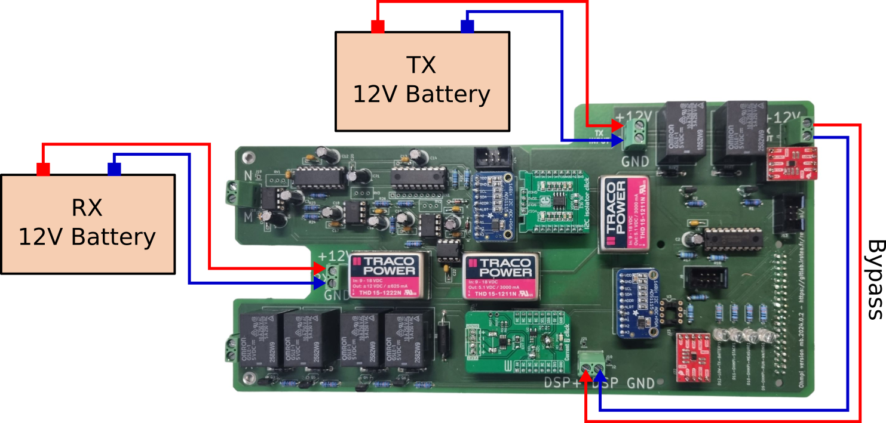
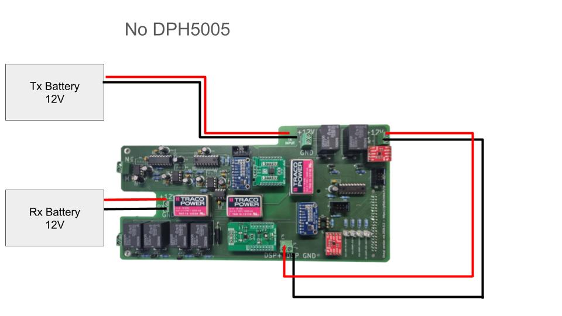
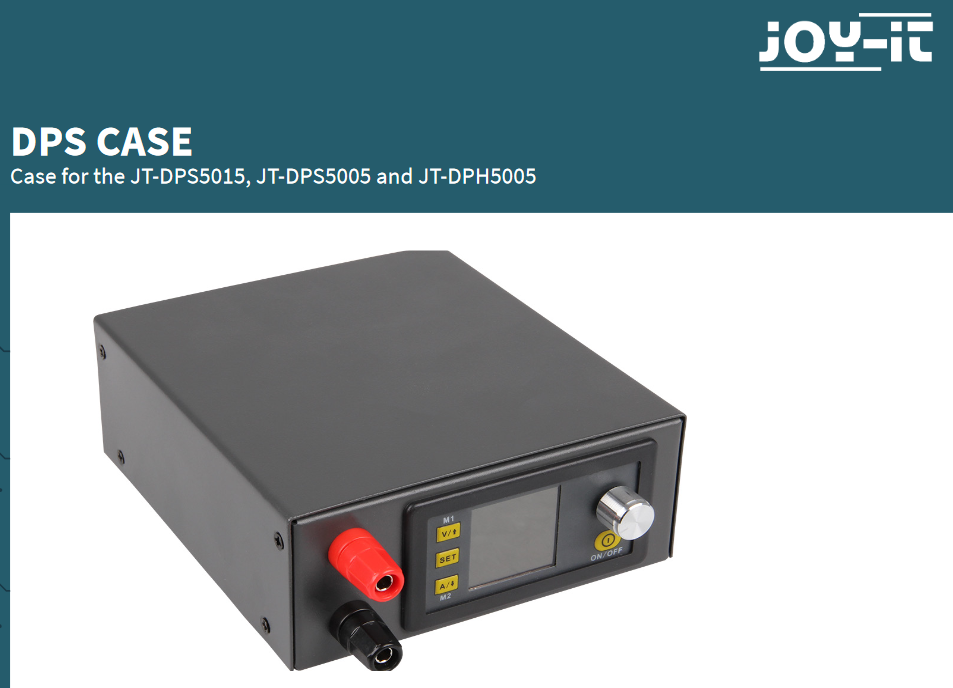
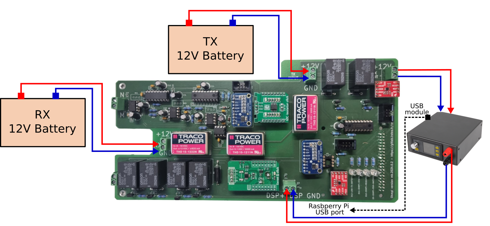
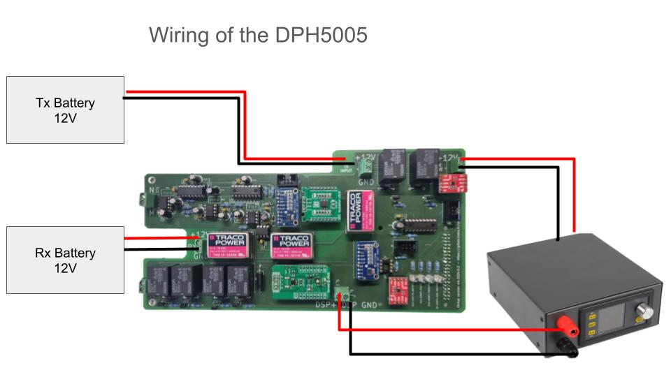

.. warning::
    **OhmPi is a participative project open to all, it requires skills in electronics and to respect the safety rules. OhmPi must be assembled in a professional context and by people competent in electronics. The OhmPi team cannot be held responsible for any material or human damage which would be associated with the use or the assembly of OHMPI. The OhmPi team cannot be held responsible if the equipment does not work after assembly.**

Power supply
****************************

Two sources of power are available now:

- an external power source (e.g. a 12V battery)
- a regulated power supply (DPH5005)

External fixed power source
===========================
In this simple configuration, a fixed power source, such as a 12V battery is used for the injection.
The + and - pins from the battery are plugged to the TX-batt input + abd GND connectors. Then the DPS input and DPS out
connectors need to be bypassed as in the figure below.

The config file needs to be adapted accordingly with the relevant battery voltage (12 V by default). Since the battery voltage (V_AB) can't be measured by OhmPi,
you should account for a potential ~10% uncertainty on R_AB, which will depend on the battery voltage level.

.. code-block:: python
  :caption: Example config pwr_batt in HARDWARE_CONFIG

  'pwr': {'model': 'pwr_batt', 'voltage': 12., 'interface_name': 'none'},

With the measurement board v2024, you can connect the Tx battery following the schematic below.

Digital power supply (DPH5005)
========================================
This digital power supply allows to inject up to 50 V and also to regulate the voltage.
It needs to be connected to a 12V battery and can be controlled via USB using `modbus` by the raspberrypi.

To assemble DPH5005, please follow the links:
 `DPH5005 manual <https://joy-it.net/files/files/Produkte/JT-DPH5005/JT-DPH5005-Manual.pdf>`_

 `DPH5005 case manual <https://joy-it.net/files/files/Produkte/JT-DPS-Case/JT-DPS-Case-Manual_20200220.pdf>`_

We recommend to purchase a DPH5005 together with a casing and a microUSB adapter.

.. Note::
    **Change the Baudrate from 9600 to 19200**, press and maintain **SET**, and start DPH5005, you acces to a new menu change **BAUD**

The DPH5005 needs to be powered from the DPS input connectors, so that the measurement board can switch it on and off as required.
The DPS power output is wired to the DPS OUT connectors, as in the figure below. Then a USB to microUSB cable
needs to be plugged in to one USB port of the Raspberry Pi.

The config file needs to be adapted accordingly, and the default output voltage can also be specified.

.. code-block:: python
  :caption: Example config pwr_dph5005 in HARDWARE_CONFIG

  'pwr': {'model': 'pwr_dph5005', 'voltage': 5.},

.. warning::
    **Only use DPH5005 with the measurement board v2024**

.. warning::
    **We sometimes refer to DPS (Digital Power Supply) as a general power supply different from the 12V battery. But this DOES NOT refer to the DPS5005 component (step down DC/DC). The component used in the documentation is the DPH5005 (boost DC/DC converter).**

Make sure to follow the setup as below (also to be seen in the assembly guide). The DPH5005 needs to be after the two relays of the measurement.

Charging the batteries
======================

It is not recommended to measure with the OhmPi when the Rx or Tx battery is charging (from solar panel or the grid).
Indeed, the charger can introduce electronic noise (50/60 Hz) but also perturb the stabilisation of the DPH5005 that will have a harder time to maintain a constant voltage during the injection on-time.
We then recommend to disable the charger (using an electronic switch for example) when doing measuremetn with the OhmPi.
