.. warning::
    **OhmPi is a participative project open to all, it requires skills in electronics and to respect the safety rules. OhmPi must be assembled in a professional context and by people competent in electronics. The OhmPi team cannot be held responsible for any material or human damage which would be associated with the use or the assembly of OHMPI. The OhmPi team cannot be held responsible if the equipment does not work after assembly.**

.. _mb2024-build:

Measurement board v2024
***********************

The 2024.0.2 measurement board has been developed to replace the 2023.0.1 measurement board. It offers superior performance compared to its predecessor. 
The current measurement component has not evolved and presents no major differences. However, the major upgrade is the Mikroe-2C Isolator Click module ('https://www.mikroe.com/i2c-isolator-click') . Specifically, 
it provides electrical isolation for the Vmn measurement set. This isolation allows for injection voltages (Vab) up to 200V

.. figure:: ../../../img/mb.2024.x.x/32.jpg       
       :width: 700px
       :align: center
       :height: 450px
       :alt: alternate text
       :figclass: align-center

Assemble
========

Schematics
~~~~~~~~~~

.. figure:: ../../../img/mb.2024.x.x/mb.2024.0.2_page-0001.jpg       
   :width: 100%
   :align: center
   :alt: alternate text
   :figclass: align-center 
   
   Overview of the measurement board.

.. figure:: ../../../img/mb.2024.x.x/mb.2024.0.2_page-0002.jpg       
   :width: 100%
   :align: center
   :alt: alternate text
   :figclass: align-center 

   Schematic of the power supply.

.. figure:: ../../../img/mb.2024.x.x/mb.2024.0.2_page-0003.jpg       
   :width: 100%
   :align: center
   :alt: alternate text
   :figclass: align-center 

   Schematic of the DPS (digital power source) power supply (e.g. DPH5005).

.. figure:: ../../../img/mb.2024.x.x/mb.2024.0.2_page-0004.jpg       
   :width: 100%
   :align: center
   :alt: alternate text
   :figclass: align-center

   Schematic of the Vmn signal conditioning.

.. figure:: ../../../img/mb.2024.x.x/mb.2024.0.2_page-0005.jpg       
   :width: 100%
   :align: center
   :alt: alternate text
   :figclass: align-center    

   Schematic of the current injection and measurement.

.. figure:: ../../../img/mb.2024.x.x/mb.2024.0.2_page-0006.jpg       
   :width: 100%
   :align: center
   :alt: alternate text
   :figclass: align-center    

   Schematic of the human-machine interface.

Required components 
~~~~~~~~~~~~~~~~~~~~

.. csv-table:: List of components
   :file: mb_2024_bom.csv
   :widths: 30, 30, 30, 30, 30, 30, 30, 30, 30, 30
   :header-rows: 1
   :class: longtable

To order the PCB (on Aisler or other manufacturer), you just need to drag and drop the .kicad_pcb (e.g. PCB_boards/measurement_boards/mb.2024.1.0/mb.2024.1.0.kicad_pcb) file into their webinterface.
The webinterface will load the PCB and walk you through different steps.

Interactive BOM list
~~~~~~~~~~~~~~~~~~~~~  

`Interactive BOM list <../../../_static/ibom.html>`_   

Before starting: how to soldering 
~~~~~~~~~~~~~~~~~~~~~~~~~~~~~~~~~

How to Solder Electronic Components <https://www.sciencebuddies.org/science-fair-projects/references/how-to-solder>

Description
~~~~~~~~~~~

Soldering various `RESISTOR <https://eepower.com/resistor-guide/resistor-fundamentals/what-is-a-resistor/#>`_ on the measurement board PCB

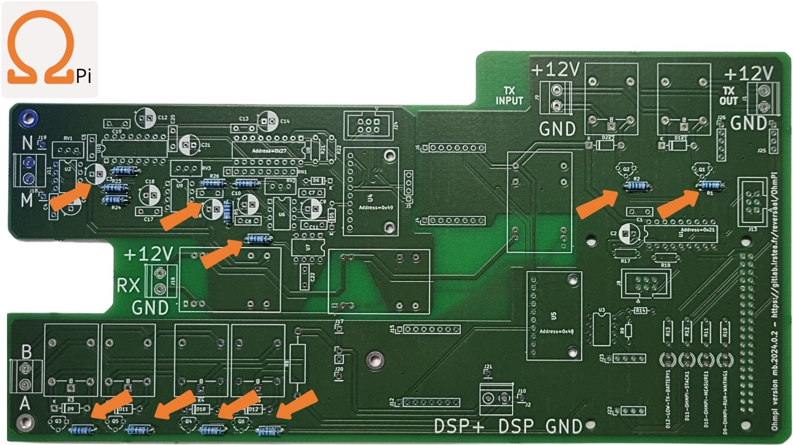

   STEP 1: Soldering thirteen 100 kOhm resistors.

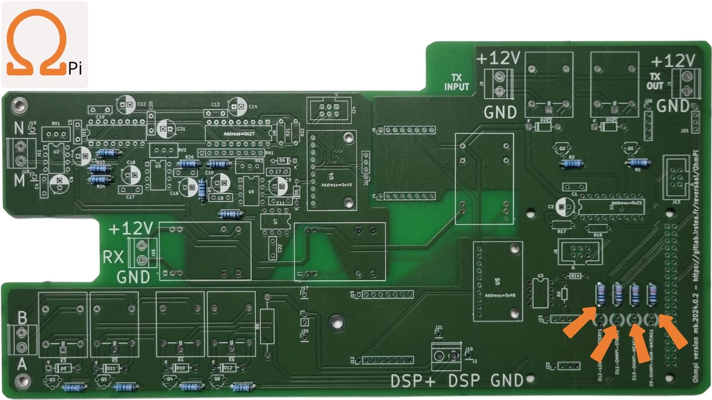

   STEP 2: soldering four (or three) 330 ohm resistors.

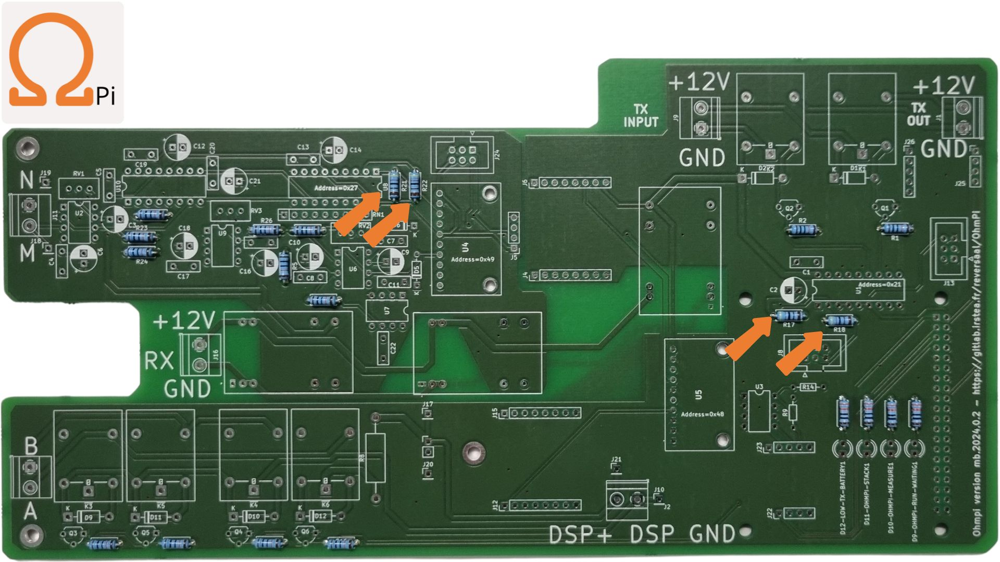

   STEP 3: Soldering four (or two) 4K7 ohm resistors.

 
Soldering `DIODE <https://www.fluke.com/en-us/learn/blog/electrical/what-is-a-diode>`_ on the measurement board PCB

.. figure:: ../../../img/mb.2024.x.x/4.jpg 
   :width: 100%
   :align: center

   STEP 4: Soldering six diodes 1N4007.

Soldering `SCHOTTKY DIODE <https://www.electronics-tutorials.ws/diode/schottky-diode.html>`_ on the measurement board PCB

.. figure:: ../../../img/mb.2024.x.x/5.jpg
   :width: 100%
   :align: center

   STEP 5: Soldering two Schottky diodes bat85 or bat86.
   
.. figure:: ../../../img/mb.2024.x.x/6.jpg
   :width: 100%
   :align: center

   STEP 6: Soldering five DIP-8 sockets. Pay attention to the direction of the notch.

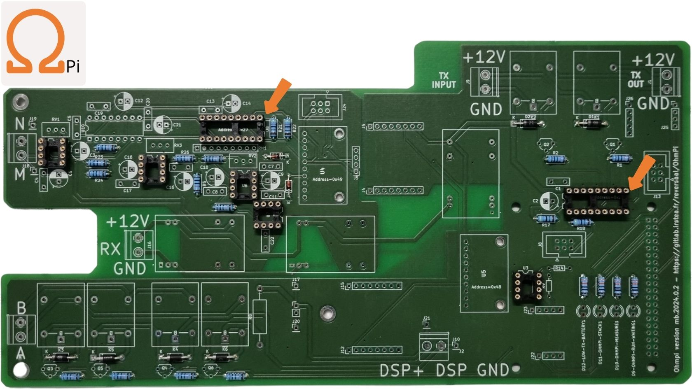

   STEP 7: Soldering two DIP-18 sockets.

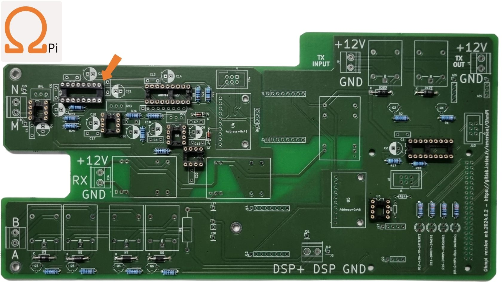

   STEP 8: Soldering one DIP-16 sockets.

.. figure:: ../../../img/mb.2024.x.x/9.jpg
   :width: 100%
   :align: center

   STEP 9: Soldering twelve cut sockets for 3 THD.
   
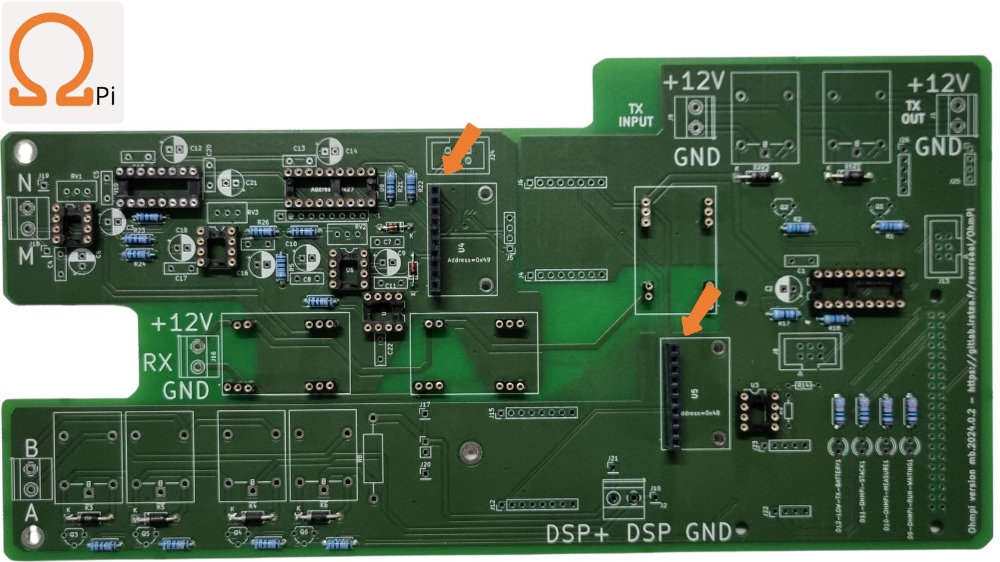

   STEP 10: Soldering header socket 1 row 10 positions.

.. figure:: ../../../img/mb.2024.x.x/11.jpg
   :width: 100%
   :align: center

   STEP 11: Soldering header sockets with 1 row and 8 positions.

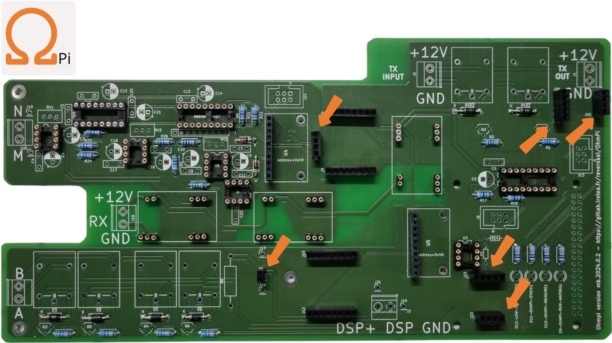

   STEP 12: Soldering 1 header (1 row, 2 positions -> cut a bigger one), 3 * 1r4p and 2 * 1r5p.

Information about `light-emitting diode <https://en.wikipedia.org/wiki/Light-emitting_diode>`_

.. figure:: ../../../img/mb.2024.x.x/13.jpg
   :width: 100%
   :align: center

   STEP 13: Installation of four light-emitting diodes. Pay attention to the polarity. Flat side towards the bottom.

Information about `MOSFET Metal Oxide Semiconductor Field Effect Transistor <https://fr.wikiversity.org/wiki/Transistor/Transistor_MOSFET#:~:text=Le%20MOSFET%20(Metal%20Oxide%20Semiconductor,la%20construction%20de%20portes%20logiques>`_

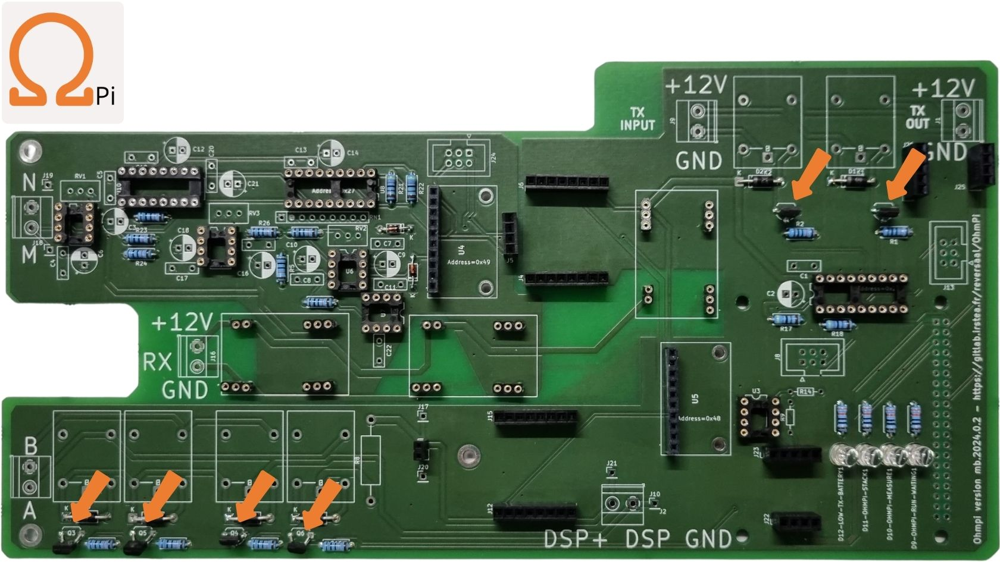

   STEP 14: Soldering six MOSFET ZVN4206 or ZVN4306.

What is a `CAPACITOR <https://en.wikipedia.org/wiki/Capacitor>`_?

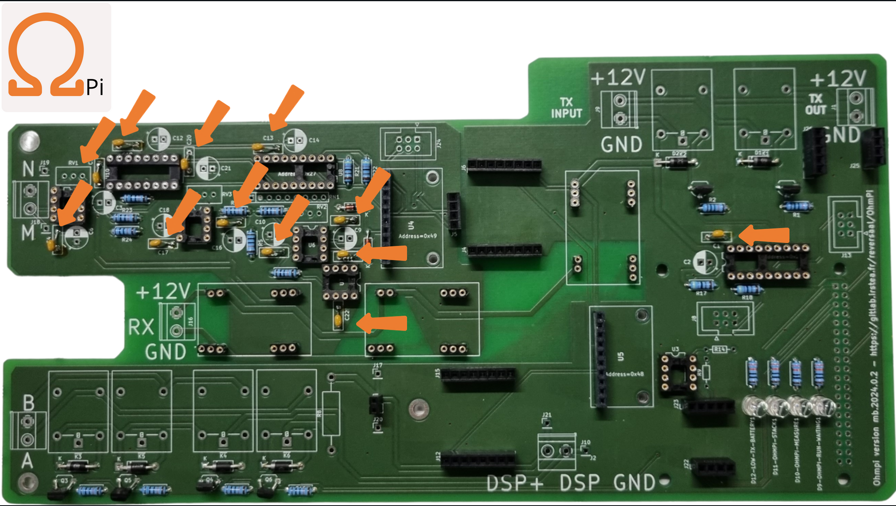

   STEP 15: Soldering twelve 100 nF 50V tantalum capacitors. These have no polarity.

.. figure:: ../../../img/mb.2024.x.x/16.jpg
   :width: 100%
   :align: center

   STEP 16: Soldering ten 10 µF 50V Electrolytic capacitors, **pay attention** to capacitor polarity.

.. warning::
     
     In this version, we used a shunt resistor of 2 Ohms, which limits the current measurement to 48 mA. If the current is higher than this value, you just have to decrease the value of the shunt resistor. Don't forget to change the shunt value in the config.py file (value associated to key 'R_shunt' in the OHMPI_CONFIG dict).   

.. figure:: ../../../img/mb.2024.x.x/17.jpg
   :width: 100%
   :align: center

   STEP 17: Soldering the 2 Ohms shunt resistor.

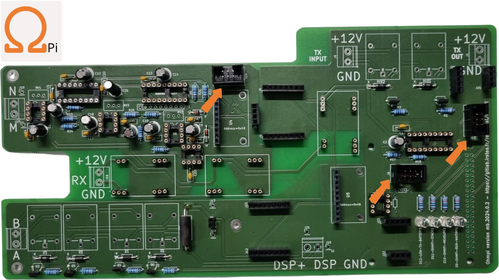

   STEP 18: Soldering the three IDC 6 pins connectors. **Pay attention to the connectors orientation!**

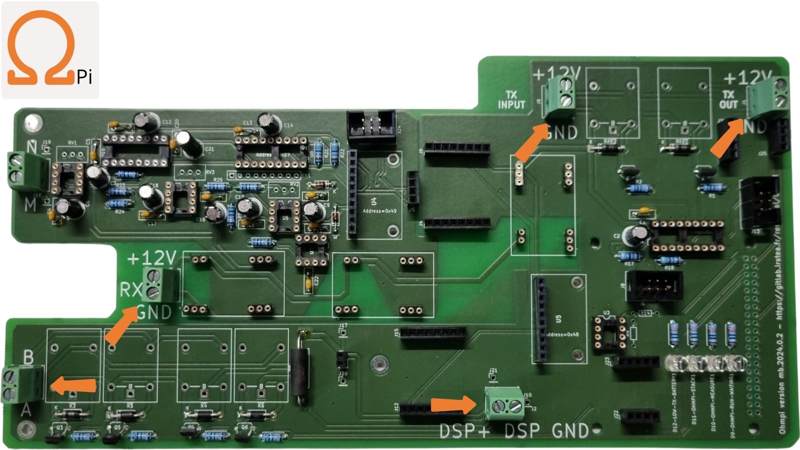

   STEP 19: Soldering six screw terminals for cable connection.

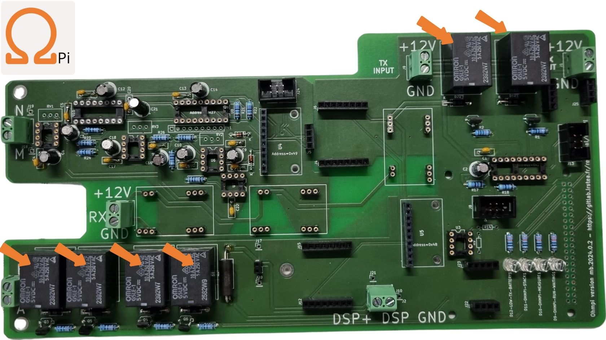

   STEP 20: Soldering six omron G5LE relays 5 VDC.

.. warning::
   The Raspberry Pi header below need to be soldered on the **under side of the PCB**.

.. figure:: ../../../img/mb.2024.x.x/21.jpg
   :width: 100%
   :align: center

   STEP 21: Soldering the 2x20 header for connection with the raspberry GPIO on **the under side of the PCB**.

What is a `Op-Amp <https://en.wikipedia.org/wiki/Operational_amplifier>`_?

In addition, the notch provides a way to visually identify the orientation of the package.

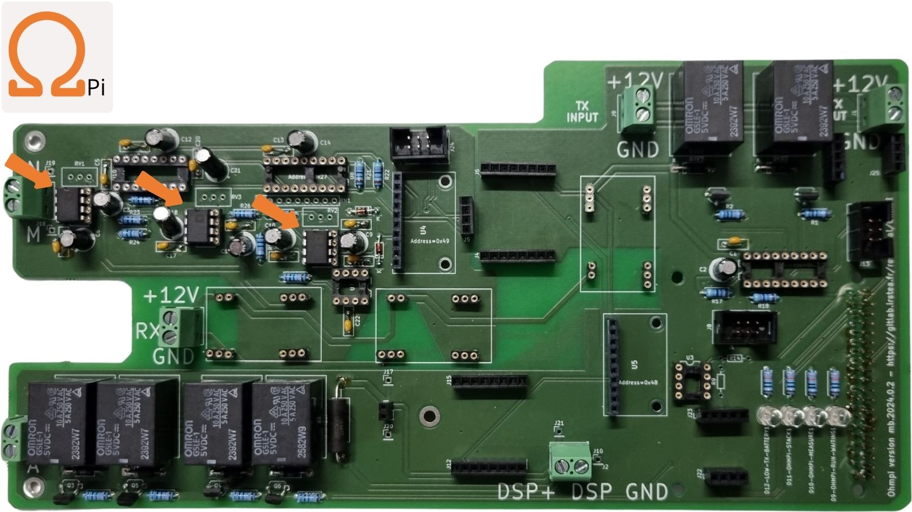

   STEP 22: Place the three OP27 on their DIP-8 sockets. **The notch must face upwards.** Make sure not to confuse OP27 with REF03.

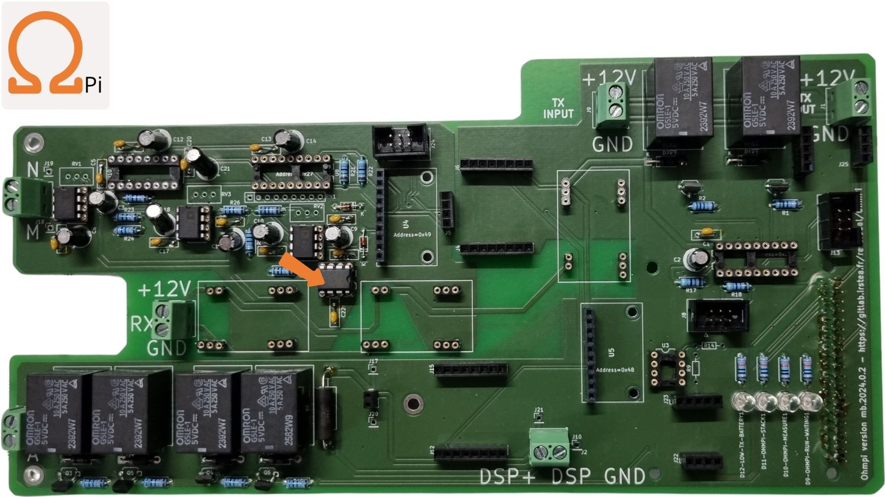

   STEP 23: Place the REF03 reference voltage (2.5V) on its DIP-8 socket. **The notch must face the right side.**  Make sure not to confuse REF03 with OP27.

What is an `analogue switch <https://en.wikipedia.org/wiki/Analogue_switch>`_?

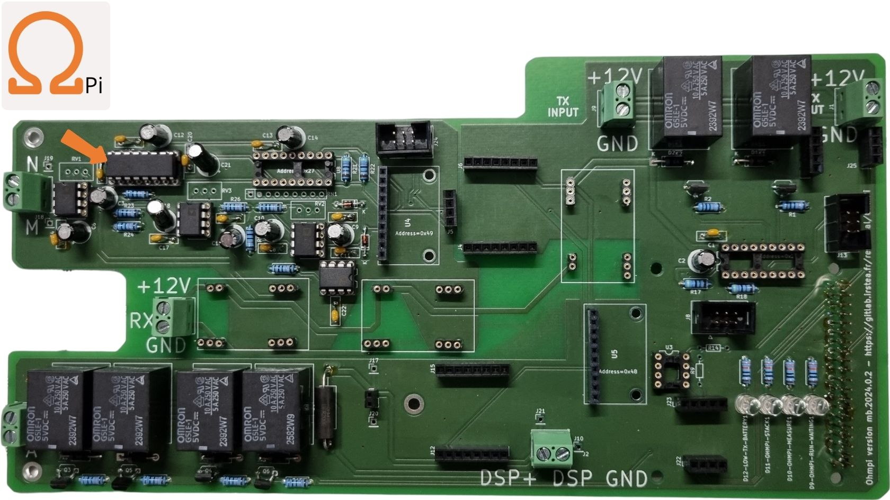

   STEP 24: Place the DG411 (**the notch must face the left side**).

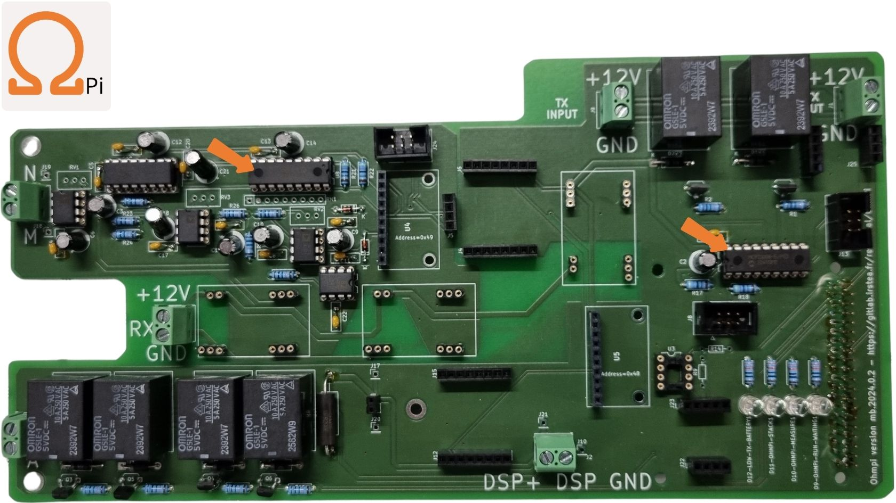

   STEP 25: Place the two MCP23008 on their DIP-16 socket (**pay attention to the notches orientation**).

.. figure:: ../../../img/mb.2024.x.x/26.jpg
   :width: 100%
   :align: center

   STEP 26: Place the Three THD, install the right reference at the right place according to the yellow boxes.

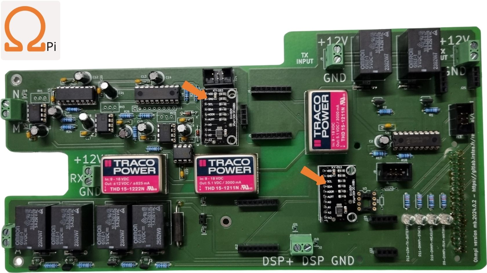

   STEP 27: Place the ADS1115 board on its female header 1x10 pins.

.. figure:: ../../../img/mb.2024.x.x/28.jpg
   :width: 100%
   :align: center

   STEP 28: Place the two I2C level adjusters.

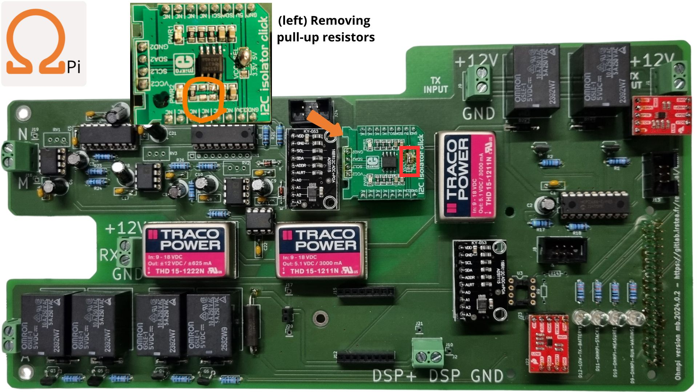

   STEP 29: Place the I2C isolator add-on board. **Make sure you have right selection**  according to the red box.

.. note::
   If you have issues with the I2C isolator (e.g. 0x49 and 0x27 are not visible), you may need
   to remove the pull-up resistor on the I2C isolator as shown above.

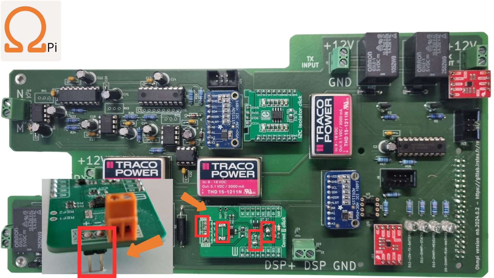

   STEP 30: Place the current click add-on board. **Make sure you have right selections** according to the red boxes.

.. note::
   Don't forget to add the two header pins below the 'shunt' side of the current click
   so it can be connected to the PCB below.

.. _mb2024-test:

Check
=====

Use the picture and table below to manually check with a multimeter for continuity and expected voltage in the measurement board.

Without power off
-----------------

If a continuity check does not pass it's likely means there is an issue with the soldering on the board.

.. figure:: ../../../img/mb2024-test.jpg       
       :width: 100%
       :align: center
       :alt: alternate text
       :figclass: align-center

.. csv-table:: Hardware check
   :file: mb2024-test-sc.csv
   :header-rows: 1

.. warning::
   **Do not power the board if one of the SC (shortcircuit) test does not pass!**

With power on
-------------

To power the board, you need to connect a 12 V source (e.g. battery) on Rx-Batt.
If the voltage with I2C (SDA and SCL pins) is not expected, there is likely an issue with pull-up resistors.

.. csv-table:: Hardware check
   :file: mb2024-test.csv
   :header-rows: 1

