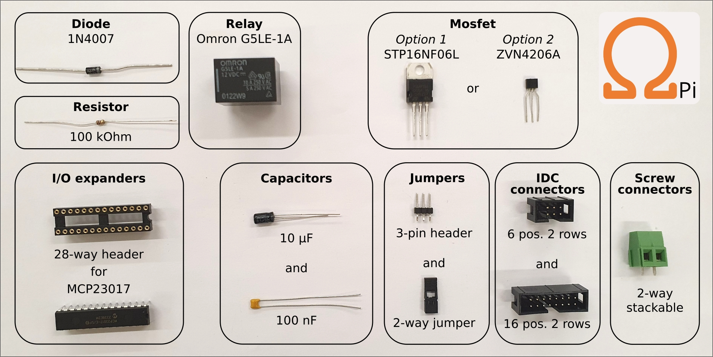
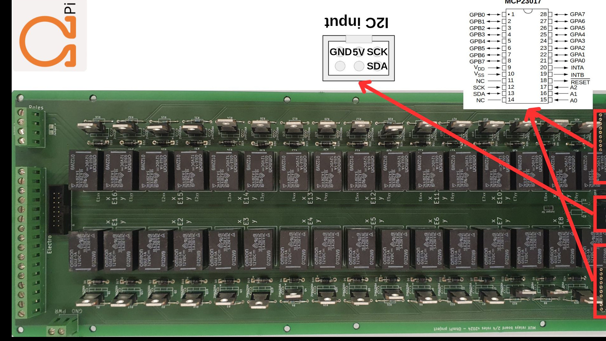

.. warning::
    **OhmPi is a participative project open to all, it requires skills in electronics and to respect the safety rules. OhmPi must be assembled in a professional context and by people competent in electronics. The OhmPi team cannot be held responsible for any material or human damage which would be associated with the use or the assembly of OHMPI. The OhmPi team cannot be held responsible if the equipment does not work after assembly.**


Build MUX board v2024
*********************

The MUX board v2024 uses the same technology than the MUX board v2023, i.e. mechanical multiplexing. However it introduces
a new level of flexibility by addressing multiple roles (A, B, M, N), which allows to build OhmPi system with multiple of 8 electrodes.
Users can physically configure the MUX board to address 2 roles (A, B or M, N) or 4 roles (A, B, M, N). With only 32 relays,
it can address 16 or 8 electrodes, for the 2- and 4-role configuration respectively.
Given the reduced number of relays, the MUX board v2024 is interfaced with only two MCP23017 I/O expanders.
This means that up to 4 MUX boards v2024 (i.e. 32-electrode system) can be directly connected to a measurement board v2024.
A newly introduced I2C extension board (featuring a TCA9548A multiplexer) allows to connect up to 32 MUX board v2024, equating to a 256-electrode system.
In theory, up to 8 I2C extension boards can be connected to the measurement board, which would allow to pilot 2048 electrodes.
For obvious practical reasons, such a configuration couldn't be tested and is likely to be limited by the I2C bus being phisically too long,
which would prevent to reach so many GPIOs.
The MUX board v2024 also comes with both IDC connectors and screw connectors for the electrode takeouts, which allows to directly connect the electrode arrays to the board.
In an effort to mitigate supply shortages, a last addition concerns the power mosfet associated with the relays,
with the possibility to mount two types of components depending on market availability: either ZVN4206A or STP16NF06L.

Here, we will present how to assemble and configure a 32-electrode system, based on 4 MUX-board v2024 set up to address 2 roles / 16 electrodes each.

**PART A** Assembly of MUX board 2024
======================================================


Required components
-------------------




.. csv-table:: List of components
   :file: ../mux/MUX_board_2024.csv
   :widths: 30, 70, 70, 70, 70, 35, 35
   :header-rows: 1
   :class: longtable


Mounting components on PCB board
--------------------------------

MUX board v2024 PCB (mux.2024.0.0).

.. table::
   :align: center

   +--------+--------------------------------------------------------------------------------+
   |    1   |   .. image:: ../../../img/mux.2024.0.x/1.jpg                                   |
   |        |        :width: 600px                                                           |
   +--------+--------------------------------------------------------------------------------+

Mount the diodes.

.. table::
   :align: center

   +--------+--------------------------------------------------------------------------------+
   |    2   |   .. image:: ../../../img/mux.2024.0.x/2.jpg                                   |
   |        |        :width: 600px                                                           |
   +--------+--------------------------------------------------------------------------------+

Mount the 100 kOhm resistors.

.. table::
   :align: center

   +--------+--------------------------------------------------------------------------------+
   |    3   |   .. image:: ../../../img/mux.2024.0.x/3.jpg                                   |
   +--------+--------------------------------------------------------------------------------+

Mount the mosfets. You can chose between ZVN4206A or STP16NF06L.

.. warning::
    In the PCB v2024.0.1, the white footprint of the ZVN4206A is upside-down. Please double check that the "drain" pint of the ZVN goes to the relay and the "source" pin goes to the ground. In doubt, refer to the ZVN datasheet. The white footprint on the PCB is corrected in v2024.0.2.


.. table::
   :align: center

   +--------+--------------------------------------------------------------------------------+
   |    4   |   .. image:: ../../../img/mux.2024.0.x/4.jpg                                   |
   +--------+--------------------------------------------------------------------------------+

Mount the MCP23017 sockets and the capacitors.

.. table::
   :align: center

   +--------+--------------------------------------------------------------------------------+
   |    5   |   .. image:: ../../../img/mux.2024.0.x/5.jpg                                   |
   +--------+--------------------------------------------------------------------------------+

Mount the screw connectors and the IDC connectors. Note that if a board is dedicated to be
configured in 2-role mode, the electrode takeouts can be mounted with 8 screw connectors only
(on electrodes 1-8) and potentially a 8 position IDC connector for the IDC takeout.

.. table::
   :align: center

   +--------+--------------------------------------------------------------------------------+
   |    6   |   .. image:: ../../../img/mux.2024.0.x/6.jpg                                   |
   +--------+--------------------------------------------------------------------------------+

Mount the relays.

.. table::
   :align: center

   +--------+--------------------------------------------------------------------------------+
   |    7   |   .. image:: ../../../img/mux.2024.0.x/7.jpg                                   |
   +--------+--------------------------------------------------------------------------------+

Defining role configuration
---------------------------
The MUX board v2024 can be configured in 2- or 4-role mode. This means that one board can either address
16 electrodes on 2 roles (X,Y for A,B or M,N), or 8 electrodes on 4 roles (labelled X,Y,XX,YY for A,B,M,N).
An OhmPi system can manage a combination of 2-role and 4-role MUX boards as long as the 2-role boards come in pairs
(e.g. 2 2-role MUX and 1 4-role MUX for 24 electrodes).

.. _2_roles:

2-role configuration
`````````````````````
This configuration is the prefered way to build systems with an even number of MUX boards (for 16, 32, 48 electrodes).
However, when assembling an OhmPi, keep in mind that 2-role mode MUX boards have to come in pairs.

To enable the 2-role mode, 2 "roles" solder jumpers have to be bridged in the front side of the PCB next to the roles connector.
To do so, the two jumper pads of each bridge have to be soldered together. This will connect roles X and roles XX together,
as well as roles Y and YY together. In this way, the board is configure in 2-role mode.
You can verify that the pair of roles X - XX and Y - YY are well connected by doing continuity checks with a digital voltmeter.

.. warning::
  Make sure that the 8 "electrodes" solder jumpers at the back of the PCB are NOT bridged to avoid risks of shortcuts !

4-role configuration
`````````````````````
Configuring a board in 4-role mode enables to use an odd number of MUX board (for systems with 8, 24, 40, 56,... electrodes).
To do so, the 8 "electrodes" solder jumpers at the back of the PCB have to be bridged. In this way relays of electrodes
relays of the following electrodes are paired together (albeit on different roles A, B, M and N): 1-16, 2-15, 3-14, 4-13, 5-12, 6-11, 7-10, 8-9.
You can verify that these combinations are connected together by continuity checks with a digital voltmeter.
It is best practice to only mount 8 screw connectors on the electrodes takeouts (and potentially only a 8 position IDC connector)
to avoid confusion when cabling the system.

.. warning::
  Make sure that the two "roles" solder jumpers at the front remain NOT bridged to avoid risks of shortcuts !

.. _mux2024addresses:

MUX board addresses
-------------------
Each MUX board v2024 comes with 2 I/O expanders MCP23017, addressing 16 relays each. They expose a pair of two I2C addresses on the I2C bus in the range 0x20 - 0x27.
Two 2-way jumpers placed on the 3-pin headers next to the IDC connector at the bottom of the board allow to shift the addesses two by two.
There is 4 possible combinations for the jumpers which give the following addresses:

+-------------------+-------------------+-------------+
| | Jumper position | | Jumper position | |    I2C    |
| |   Addr1         | | Addr2           | | addresses |
+-------------------+-------------------+-------------+
|        Up         |        Up         | 0x20 - 0x21 |
+-------------------+-------------------+-------------+
|       Down        |        Up         | 0x22 - 0x23 |
+-------------------+-------------------+-------------+
|        Up         |       Down        | 0x24 - 0x25 |
+-------------------+-------------------+-------------+
|       Down        |       Down        | 0x26 - 0x27 |
+-------------------+-------------------+-------------+

The jumper positions of each ('up' or 'down' have to be carefully filled in the configuration file). One can check the I2C
addresses visible on the I2C bus by typing the following command on the Raspberry Pi terminal,
assuming that the MUX boards are powered and correctly connected to the measurement board:

.. code-block:: bash

   i2cdetect -y 4

Replace "-y 4" by "-y 1" if the MUX is plugged on the "board" IDC connector, or if plugged in to a mb.2023.0.X board.


**PART B** Assembling MUX boards in an OhmPi system
===================================================

The cabling of several MUX boards v2024 within an OhmPi system is entirely dependent on the role configuration of each board.

* 2-role MUX boards have to come in pairs. The 16 electrodes takeouts of each pair have to be cabled together. This is easily done with a ribbon cable
  plugged on the 16-way IDC connectors of the pair of boards. This also allows to stack two boards together leaving the screw connectors of the board on the top
  accessible to connect wires from the electrode arrays.
* 4-role MUX boards do not have to come in pairs. The 4 roles of each board have to be connected to the other 4 roles of the system (and at least to the ABMN connector on the measurement board).
  The electrodes connectors can only be used to address the first 8 or the last 8 positions.
  This is critical if wanting to connect the electrodes via the IDC connectors, which whill have to be carefully cabled.


.. _mux2024-test:

Check MUX board v2024
*********************

Use the picture and table below to manually check with a multimeter for continuity and expected voltage in the board.
Check your board against the correct expected column: 2-roles or 4-roles.

If a continuity check does not pass it's likely means there is an issue with the soldering on the board.
If the voltage with I2C (SDA and SCL pins) is not expected, there is likely an issue with pull-up resistors.
For the test with power "on", we expect the mux board to be connected to a 12V supply via the screw terminals and to the measurement board via the IDC ribbon cable.



.. csv-table:: Hardware check
   :file: mux2024-test-sc.csv
   :header-rows: 1

.. warning::
   **Do not power the board if one of the SC (shortcircuit) test does not pass!**

.. csv-table:: Hardware check
   :file: mux2024-test.csv
   :header-rows: 1
