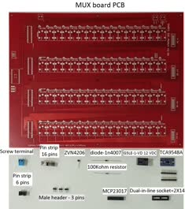

.. warning::
    **OhmPi is a participative project open to all, it requires skills in electronics and to respect the safety rules. OhmPi must be assembled in a professional context and by people competent in electronics. The OhmPi team cannot be held responsible for any material or human damage which would be associated with the use or the assembly of OHMPI. The OhmPi team cannot be held responsible if the equipment does not work after assembly.**

MUX board v2024
****************************************************

The MUX board v2024 uses the same technology than the MUX board v2023, i.e. mechanical multiplexing. However it introduces
a new level of flexibility by addressing multiple roles (A, B, M, N), which allows to build OhmPi system with multiple of 8 electrodes.
Users can physically configure the MUX board to address 2 roles (A, B or M, N) or 4 roles (A, B, M, N). With only 32 relays,
it can address 16 or 8 electrodes, for the 2- and 4-role configuration respectively.
Given the reduced number of relays, the MUX board v2024 is interfaced with only two MCP23017 I/O expanders.
This means that up to 4 MUX boards v2024 (i.e. 32-electrode system) can be directly connected to a measurement board v2024.
A newly introduced I2C extension board (featuring a TCA9548A multiplexer) allows to connect up to 32 MUX board v2024, equating to a 256-electrode system.
In theory, up to 8 I2C extension boards can be connected to the measurement board, which would allow to pilot 2048 electrodes.
For obvious practical reasons, such a configuration couldn't be tested and is likely to be limited by the I2C bus being phisically too long,
which would prevent to reach so many GPIOs.
In an effort to mitigate supply shortages, a last addition concerns the power mosfet associated with the relays,
with the possibility to mount two types of components depending on market availability: either ZVN4206A or STP16NF06L.

Here, we will present how to assemble and configure a 32-electrode system, based on 4 MUX-board v2024 set up to address 2 roles / 16 electrodes each.

**PART A** Assembly of MUX board
======================================================

Required components 
----------------------------------------------------

.. csv-table:: List of components
   :file: ../../../img/v2023.x.x/step_n_3/a/MUX_board_list_2_xx.csv
   :widths: 30, 70, 70, 70, 70, 35, 35
   :header-rows: 1 
   
   
.. table::
   :align: center
   
   +--------+--------------------------------------------------------------------------------+
   |        |   .. image:: ../../../img/v2023.x.x/step_n_3/a/MUX_00.jpg                      |
   |      1 +--------------------------------------------------------------------------------+
   |        |Mux board pcb                                                                   | 
   |        |                                                                                |                                                                       
   +--------+--------------------------------------------------------------------------------+

.. table::
   :align: center
   
   +--------+------------------------------------------------------------+
   |        |   .. image:: ../../../img/v2023.x.x/step_n_3/a/MUX_01.jpg  |
   |      2 +------------------------------------------------------------+
   |        |Installation of the 100 kOhm resistors                      |
   |        |                                                            |                                                                       
   +--------+------------------------------------------------------------+   
   
.. table::
   :align: center
   
   +--------+------------------------------------------------------------+
   |        |   .. image:: ../../../img/v2023.x.x/step_n_3/a/MUX_02.jpg  |
   |      3 +------------------------------------------------------------+
   |        |Installation of the MOSFET ZVN4206A                         |
   |        |                                                            |                                                                       
   +--------+------------------------------------------------------------+      
   
   
.. table::
   :align: center
   
   +--------+------------------------------------------------------------+
   |        |   .. image:: ../../../img/v2023.x.x/step_n_3/a/MUX_03.jpg  |
   |      4 +------------------------------------------------------------+
   |        |Installation of the diode 1N4007                            |
   |        |                                                            |                                                                       
   +--------+------------------------------------------------------------+    
   
.. table::
   :align: center
   
   +--------+------------------------------------------------------------+
   |        |   .. image:: ../../../img/v2023.x.x/step_n_3/a/MUX_04.jpg  |
   |      5 +------------------------------------------------------------+
   |        |Installation of the relay                                   | 
   |        |                                                            |                                                                       
   +--------+------------------------------------------------------------+  

.. table::
   :align: center
   
   +--------+------------------------------------------------------------+
   |        |   .. image:: ../../../img/v2023.x.x/step_n_3/a/MUX_05.jpg  |
   |      6 +------------------------------------------------------------+
   |        |Installation of the terminal screw                          | 
   |        |                                                            |                                                                       
   +--------+------------------------------------------------------------+

.. table::
   :align: center
   
   +--------+------------------------------------------------------------+
   |        |   .. image:: ../../../img/v2023.x.x/step_n_3/a/MUX_06.jpg  |
   |      7 +------------------------------------------------------------+
   |        |Installation of generic male header                         | 
   |        |                                                            |                                                                       
   +--------+------------------------------------------------------------+ 

.. table::
   :align: center
   
   +--------+------------------------------------------------------------+
   |        |   .. image:: ../../../img/v2023.x.x/step_n_3/a/MUX_07.jpg  |
   |      8 +------------------------------------------------------------+
   |        |Installation of Pin strip (6 pins)  and pin strip (16 pins) | 
   |        |                                                            |                                                                       
   +--------+------------------------------------------------------------+  

.. table::
   :align: center
   
   +--------+------------------------------------------------------------+
   |        |   .. image:: ../../../img/v2023.x.x/step_n_3/a/MUX_08.jpg  |
   |      9 +------------------------------------------------------------+
   |        |Installation of DIP Dual In Line Socket 2*14                | 
   |        |                                                            |                                                                       
   +--------+------------------------------------------------------------+  

.. table::
   :align: center
   
   +--------+------------------------------------------------------------+
   |        |   .. image:: ../../../img/v2023.x.x/step_n_3/a/MUX_09.jpg  |
   |     10 +------------------------------------------------------------+
   |        |Installation of Adafruit TCA9548A                           | 
   |        |                                                            |                                                                       
   +--------+------------------------------------------------------------+

.. table::
   :align: center
   
   +--------+------------------------------------------------------------+
   |        |   .. image:: ../../../img/v2023.x.x/step_n_3/a/MUX_10.jpg  |
   |     10 +------------------------------------------------------------+
   |        |Installation of MCP23017                                    | 
   |        |                                                            |                                                                       
   +--------+------------------------------------------------------------+  
   
.. note:: 
     This step must be duplicated 4 times for every Mux card.

**PART B** MUX board address
====================================================== 
A MUX v2024 comes with 2 I/O expanders (MCP23017) addressing 16 relays each. They can be identified by the Raspberry Pi unit
with their I2C address ranging 0x20 - 0x27. Two jumpers allow to shift the addresses two by two based on the following combination:

+-------------+-----------------+------------------+
| addresses   | Addr1 position  |  Addr2 position  |
+=============+=================+==================+
| 0x20 - 0x21 |       Up        |       Up         |
+-------------+-----------------+------------------+
| 0x22 - 0x23 |      Down       |       Up         |
+-------------+-----------------+------------------+
| 0x24 - 0x25 |       Up        |      Down        |
+-------------+-----------------+------------------+
| 0x26 - 0x27 |      Down       |      Down        |
+-------------+-----------------+------------------+

.. table::
   :align: center
   
   +--------+------------------------------------------------------------+
   |        |   .. image:: ../../../img/v2023.x.x/step_n_3/b/A_0x70.jpg  |
   |     1  +------------------------------------------------------------+
   |        |Mount the jumpers and note the value of the address and the |
   |        |electrode name on the mux board (A).                        |                                                                       
   |        +------------------------------------------------------------+  
   |        |   .. image:: ../../../img/v2023.x.x/step_n_3/b/A_0x70-a.jpg|
   |        +------------------------------------------------------------+
   |        |Zoom on the jumper                                          | 
   |        |                                                            |   
   +--------+------------------------------------------------------------+   

  

   
For the B electrode board, we suggest addressing it with address 0x71:

.. table::
   :align: center
   
   +--------+------------------------------------------------------------+
   |        |   .. image:: ../../../img/v2023.x.x/step_n_3/b/B_0x71.jpg  |
   |     2  +------------------------------------------------------------+
   |        |Mount the jumpers and note the value of the address and the |
   |        |electrode name on the mux board (B).                        |                                                                       
   |        +------------------------------------------------------------+  
   |        |   .. image:: ../../../img/v2023.x.x/step_n_3/b/B_0x71-a.jpg|
   |        +------------------------------------------------------------+
   |        |Zoom on the jumper                                          | 
   |        |                                                            |   
   +--------+------------------------------------------------------------+ 

For the N electrode board, we suggest addressing it with address 0x72:

.. table::
   :align: center
   
   +--------+------------------------------------------------------------+
   |        |   .. image:: ../../../img/v2023.x.x/step_n_3/b/M_0x72.jpg  |
   |     3  +------------------------------------------------------------+
   |        |Mount the jumpers and note the value of the address and the |
   |        |electrode name on the mux board (B).                        |                                                                     
   |        +------------------------------------------------------------+  
   |        |   .. image:: ../../../img/v2023.x.x/step_n_3/b/M_0x72-a.jpg|
   |        +------------------------------------------------------------+
   |        |Zoom on the jumper                                          | 
   |        |                                                            |   
   +--------+------------------------------------------------------------+ 

For the M electrode board, we suggest addressing it with address 0x73: 
  
.. table::
   :align: center
   
   +--------+------------------------------------------------------------+
   |        |   .. image:: ../../../img/v2023.x.x/step_n_3/b/N_0x73.jpg  |
   |     4  +------------------------------------------------------------+
   |        |Mount the jumpers and note the value of the address and the |
   |        |electrode name on the mux board (B).                        |                                                                     
   |        +------------------------------------------------------------+  
   |        |   .. image:: ../../../img/v2023.x.x/step_n_3/b/N_0x73-a.jpg|
   |        +------------------------------------------------------------+
   |        |Zoom on the jumper                                          | 
   |        |                                                            |   
   +--------+------------------------------------------------------------+    

**PART C** Validation of MUX board
======================================================
The first step is to test the Mux boards before assembling them definitively.
To test the Mux boards, it will be necessary first to make a simplified assembly of the Mux board and the measurement board.

The first thing to do is to prepare a 50 cm long flat wire with two 6-poles connectors.

   +--------+--------------------------------------------------------------------+
   |        |   .. image:: ../../../img/v2023.x.x/step_n_3/c/20211207_115706.jpg |
   |     1  +--------------------------------------------------------------------+
   |        |Build a cable with 6 contacts with 6 pins connector.                |
   |        |                                                                    |                                                                     
   +--------+--------------------------------------------------------------------+ 
 
   +--------+--------------------------------------------------------------------+
   |        |   .. image:: ../../../img/v2023.x.x/step_n_3/c/20220124_142929.jpg |
   |     2  +--------------------------------------------------------------------+
   |        |Prepare the measurement board and the first mux board by            |
   |        |example the card with address 0x71.                                 |                                                                     
   +--------+--------------------------------------------------------------------+

   +--------+--------------------------------------------------------------------+
   |        |   .. image:: ../../../img/v2023.x.x/step_n_3/c/20220124_143105.jpg |
   |     3  +--------------------------------------------------------------------+
   |        |Connect the 12V power supply cables to the MUX board                |
   |        |without powering the board.                                         |                                                                     
   +--------+--------------------------------------------------------------------+   

   +--------+---------------------------------------------------------------------+
   |        |   .. image:: ../../../img/v2023.x.x/step_n_3/c/20220207_154111.jpg  |
   |     4  +---------------------------------------------------------------------+
   |        |Connect the 12V power supply screw terminal of the mux            -  |
   |        |board to the 12V screw terminal power supply of the                  |
   |        |measurement board.                                                   |
   +--------+---------------------------------------------------------------------+   

   +--------+---------------------------------------------------------------------+
   |        |   .. image:: ../../../img/v2023.x.x/step_n_3/c/20220124_143823.jpg  |
   |     5  +---------------------------------------------------------------------+
   |        |Connect the 6-contact cable                                          |
   |        |                                                                     |                                                                     
   +--------+---------------------------------------------------------------------+
   

Start your 12V power supply, the raspberry must start. 

Run the terminal and write:

 .. code-block:: python

     i2cdetect -y 1

Three addresses should appear, including the address of the MUX board you have selected. This implies that your board has been detected.

Open the script called "test_mux_board.py".

Run the script

   
   