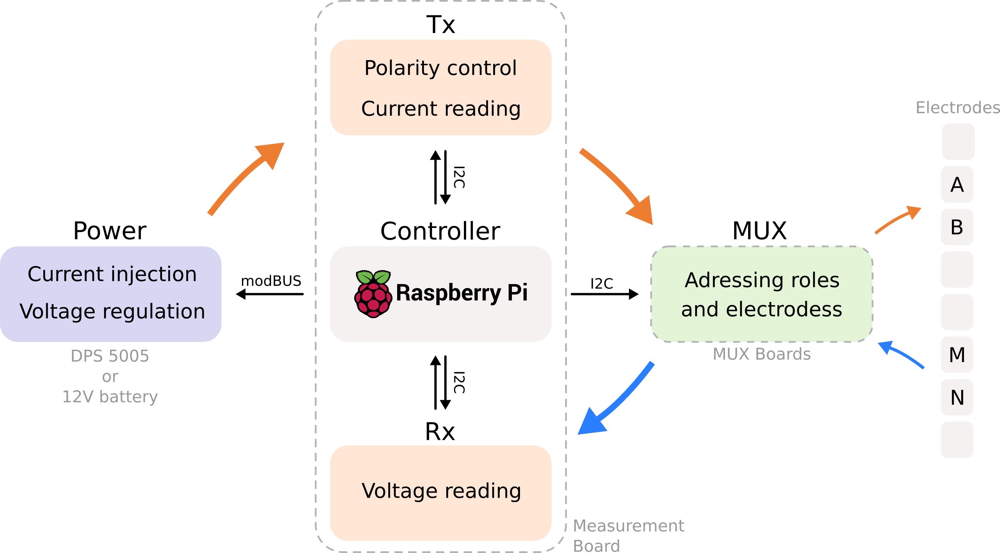

***************
System Overview
***************

    .. image:: ../../img/logo/ohmpi/LOGO_OHMPI.png
        :align: center
        :width: 336px
        :height: 188px
        :alt: Logo OhmPi

.. warning::
    OhmPi is a participative project open to all, it requires skills in electronics and to respect the safety rules.
    OhmPi must be assembled in a professional context and by people competent in electronics. The OhmPi team cannot be
    held responsible for any material or human damage which would be associated with the use or the assembly of OhmPi.
    The OhmPi team cannot be held responsible if the equipment does not work after assembly. You may redistribute and
    modify this documentation and make products using it under the terms of the CERN-OHL-P v2. This documentation is
    distributed WITHOUT ANY EXPRESS OR IMPLIED WARRANTY, INCLUDING OF MERCHANTABILITY, SATISFACTORY QUALITY AND FITNESS
    FOR A PARTICULAR PURPOSE. Please see the CERN-OHL-P v2 for applicable conditions.

What is OhmPi?
**************

The OhmPi project was initiated to develop an open-source, open-hardware resistivity meter,
particularly designed for the research community, education, and humanitarian or not-for-profit organisations.
In the last decade, geoelectrical monitoring has become a popular tool to study and monitor
physical processes in hydrology. As novel applications emerge, the need for more accessible and flexible acquisition systems
grows in the research community. The flexibility and adaptability of OhmPi makes it particularly suited to
develop novel acquisition strategies or design innovative small-scale monitoring experiments.

.. note::
   Anyone who wants to get involved is welcome to join the OhmPi project!

How does it work?
*****************

The OhmPi is composed of different modules:

- a measurements board (``mb``): that measures the current and voltage and modulates the injected current
- 0, 1, ... or n multiplexer boards (``mux``): that address different electrodes
- a power supply (``pwr``): either a 12V battery or a more advanced power supply where we can control the voltage/current
- a general controller (``ctrl``): to control the measurement board, multiplexer boards and power supply (=raspberrypi)

These module exists in different versions and can be combined using a configuration file.
You can then upgrade your measurement board or power supply for specific applications.

  OhmPi hardware flowchart.

How does it look like?
**********************

.. warning::
    We **strongly** recommend to test the assembled system in a controlled environment (in the lab, on resistor boards) before deploying
    in the field!

.. image:: ../../img/ohmpi_systems_examples.jpg
   :width: 900px
   :align: center