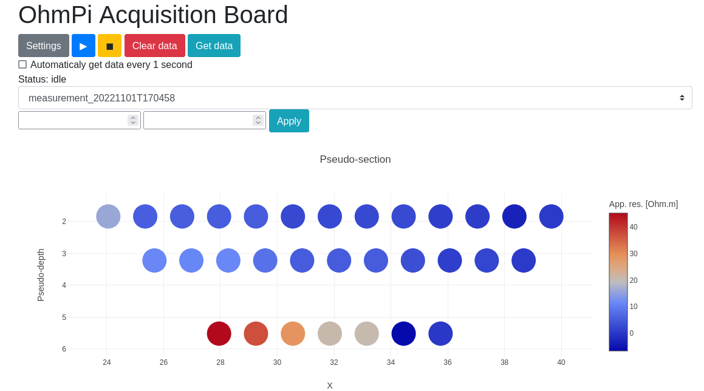
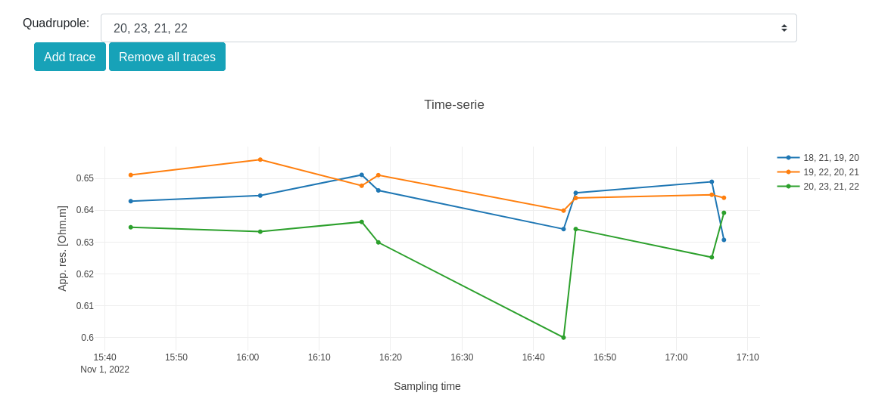
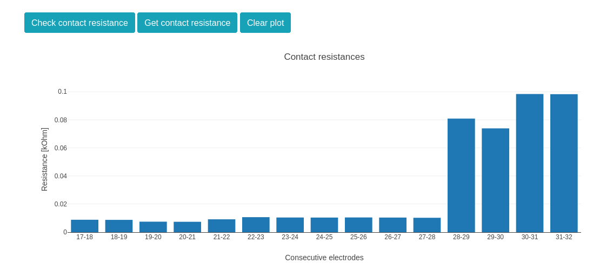
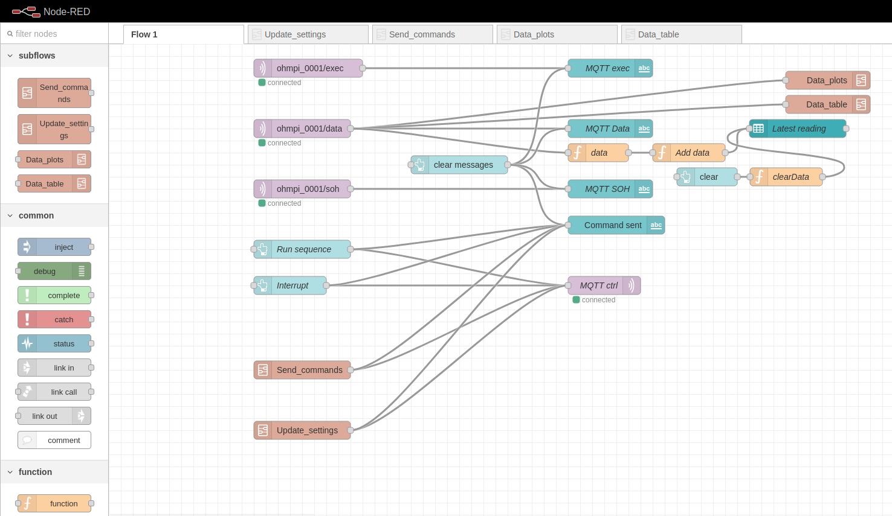
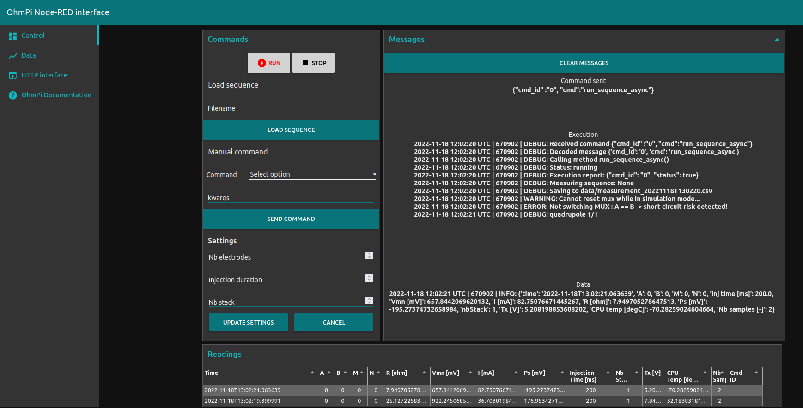

Interfaces
**********

Different interfaces can be used to interact with the OhmPi.

Available interfaces are:
- `Web interface`_ (=HTTP interface): run in bash: `bash run_http_interface.sh`
- Python API: import the OhmPi class from Python script: `from ohmpi import OhmPi` (see `Python interface`_)
- MQTT: IoT messaging through a broker (see `MQTT interface`_)

Web interface
=============

This is a user friendly graphical interface for new users as well as running quick and easy acquisitions.

The Raspberry Pi of the OhmPi is used as a Wi-Fi Access Point (AP) and runs
a small webserver to serve the 'index.html' interface. Using a laptop or
a mobile phone connected to the Wi-Fi of the Raspberry Pi, one can see this
interface, upload sequences, change parameters, run a sequence and download data.

To configure the Raspberry Pi to act as an access point and run
the webserver automatically on start, see instructions on `raspap.com <https://raspap.com/>`_ and in 'runOnStart.sh'.

Once configured, the webserver should start by itself on start and once
connected to the Pi, the user can go to `10.3.141.1:8080 <http://10.3.141.1:8080>`_
to access the interface.

    Web interface with its interactive pseudo-section.

     Evolution of quadrupole apparent resistivity with time.

     Contact resistance check.

Python interface
================

This interface offers a more direct access to the software components, specifically suited for testing or automating acquisition.

By importing the `OhmPi` class from the ohmpi.py, we can control the OhmPi instrument via a Python script or interactively with IPython.
It involves using the terminal or a Python IDE such as Thonny on the Raspberry Pi. A connection can also be established via
SSH (see PuTTY on Windows or ssh command on macOS/Linux).

To access the Python API, make sure that the PYTHONPATH has been correctly configured to export the location of the ohmpi module.

.. code-block:: python
  :caption: Example of using the Python API to control OhmPi

  from ohmpi.ohmpi import OhmPi

  ### Define object from class OhmPi
  k = OhmPi()  # this loads default parameters from the disk

  ### Default parameters can also be edited manually
  k.settings['injection_duration'] = 0.5  # injection time in seconds
  k.settings['nb_stack'] = 1  # one stack is two half-cycles
  k.settings['nbr_meas'] = 1  # number of time the sequence is repeated

  ### Update settings if needed
  k.update_settings({"injection_duration":0.2})

  ### Set or load sequence
  k.sequence = np.array([[1,2,3,4]])    # set numpy array of shape (n,4)
  # k.set_sequence('1 2 3 4\n2 3 4 5')    # call function set_sequence and pass a string
  # k.load_sequence('ABMN.txt')    # load sequence from a local file

  ### Run contact resistance check
  k.rs_check()

  ### Run sequence (synchronously - it will wait that all
  # sequence is measured before returning the prompt
  k.run_sequence()
  # k.run_sequence_async()  # sequence is run in a separate thread and the prompt returns immediately
  # time.sleep(2)
  # k.interrupt()  # kill the asynchron sequence

  ### Run multiple sequences at given time interval
  k.settings['nb_meas'] = 3  # run sequence three times
  k.settings['sequence_delay'] = 100 # every 100 s
  k.run_multiple_sequences()  # asynchron
  # k.interrupt()  # kill the asynchron sequence

  ### Single measurement can also be taken with
  quadrupole = [1, 4, 2, 3]
  k.run_measurement(quadrupole)  # use default acquisition parameters

  ### Custom or adaptative argument, see help(k.run_measurement)
  k.run_measurement(quadrupole,
                    nb_stack=4,  # do 4 stacks (8 half-cycles)
                    injection_duration=1,  # inject for 2 seconds
                    duty_cycle = 0.5) # duty_cycle is

For detailed usage, please see the Python API or look at the examples.

.. _IoT-interface:
IoT interface
=============

This is an interface designed for an advanced remote usage of the OhmPi such as remote automation, data consumption by multiple processes and interaction with other sensors in the scope of a monitoring. It is based on the MQTT protocol, designed for the Internet of Things (IoT), to interact with the OhmPi.

This option allows interacting remotely with a single OhmPi, a network of OhmPis, as well as auxiliary instruments and sensors. The communication is based on a publish/subscribe approach and involves a MQTT broker.

An example of MQTT broker that can be used is `Mosquitto <https://mosquitto.org/>`_. Depending on the monitoring needs, an MQTT broker can be set up locally on the Raspberry Pi, on a local network or any remote server reachable through the net. A local Mosquitto broker can be set up and enabled to run as a service on the OhmPi using the bash script install_local_mqtt_broker.sh.

MQTT messages include logging messages from the OhmPi and commands sent to the OhmPi. These messages can be examined easily using a third party software such as `MQTT Explorer <http://mqtt-explorer.com/>`_.

Commands sent on the broker are received by the ohmpi.py script that runs on the OhmPi (make sure ohmpi.py starts on reboot) and further processed.
MQTT commands are sent in JSON format following the Python API with kwargs as illustrated below:

.. code-block:: json
  :caption: Updating acquisition settings.

  {
    "cmd_id": "3fzxv121UITwGjWYgcz4xw",
    "cmd": "update_settings", Depending on the experiment needs, MQTT brokers can be set up locally on the Raspberry Pi or on a local or remote server.
    "kwargs": {
      "config": {
        "nb_meas": 2,
        "nb_electrodes": 10,
        "nb_stack": 2,
        "injection_duration": 2,
        "sequence_delay": 100
      }
    }
  }

.. code-block:: json
  :caption: Check contact resistances

  {
    "cmd_id": "3fzxv121UITwGjWYgcz4xw",
    "cmd": "rs_check",
  }

.. code-block:: json
  :caption: Running a sequence.

  {
    "cmd_id": "3fzxv121UITwGjWYgcz4Yw",
    "cmd": "run_sequence",
  }

.. code-block:: json
  :caption: Running same sequence multiple times (nb_meas).

  {
    "cmd_id": "3fzxv121UITwGjWYgcz4Yw",
    "cmd": "run_multiple_sequences",
  }

.. code-block:: json
  :caption: Interrupt current acquisition.

  {
    "cmd_id": "3fzxv121UITwGjWYgcz4xw",
    "cmd": "interrupt",
  }

Custom processing of messages and tailor-made dashboards for monitoring experiments may be designed using a browser-based flow editor such as `Node-red <http://mqtt-explorer.com/>`_.
This may help designing complex IoT experiments and monitoring systems in which OhmPi is a component.

Examples incorporating execution commands and data outputs from OhmPi can be found in the OhmPi examples. Once Node-RED is installed on the OhmPi, these examples can be accessed separately by running a command in the console such as :

.. code-block:: console

  node-red basic_ohmpi_flows_node-red.json

These examples may require installing some additional node packages in order to work properly. This can be done in the `Palette Manager <https://nodered.org/docs/user-guide/editor/palette/manager>`_ within Node-RED.

     Example flow in node-red to interact with an OhmPi.

     Example of a dashboard UI created with node-red to interact with an OhmPi - control tab.

.. figure:: ../../../img/software/node-red_interface_data.png

     Example of a dashboard UI created with node-red to interact with an OhmPi - data visualization tab.

For more documentation dedicated to node-red, please refer to the Node-red `cookbooks <https://cookbook.nodered.org/>`_.
