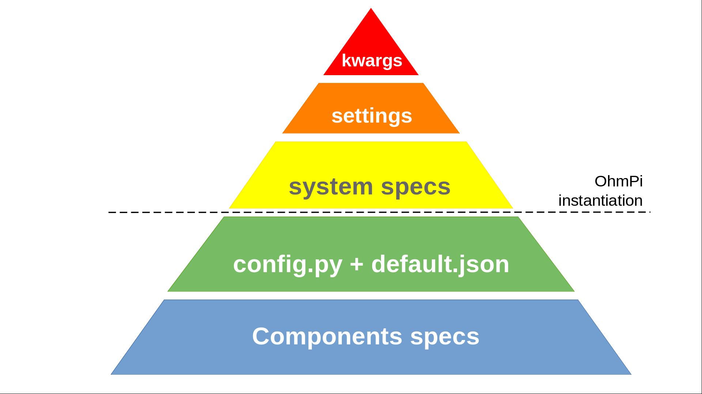
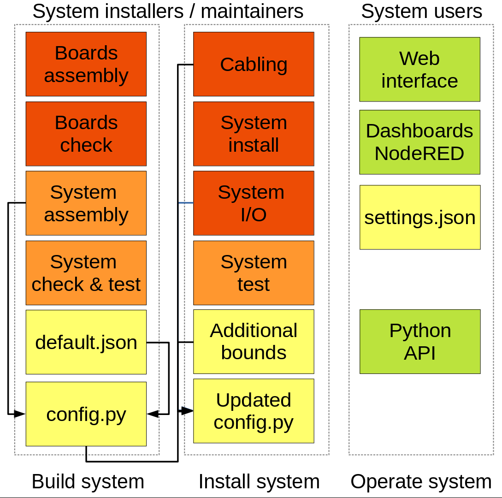

.. _settings:

Acquisition settings
********************

The acquisition settings can be changed or constrained at different levels of the system.

  **kwargs** (keyword arguments) passed to Python functions superseed **OhmPi.settings** attribute. All settings must fall within the **system specifications**. All the previous are defined when we instantiate the OhmPi class. Further down, the **config.py** and **default.json** files provide default values values and constrained. That are further enforced in the **component specifications**.

Different parts of the system can be changed. We distinguish two roles: maintainers that will build, set the configuration and provide default settings. And the users who will operate the system using the different interfaces and change acquisition settings.

This section details the acquisition settings that can be specified for measurement on a quadrupole.

.. code-block:: python
  :caption: json dictionary containing the default settings contained in ``settings/default.json``

    {
    "injection_duration": 0.2, # injection duration of one pulse within an injection cycl
    "n_stacks": 1, # number of injection cycles (e.g. 'nb_stack'=1 means one positive and one negative pulse)
    "sampling_interval": 2, # sampling interval in ms
    "vab_req": 5, # injection voltage in V for strategy 'safe' or starting V_AB for strategy 'vmax' or 'vmin'
    "duty_cycle": 0.5, # duty cycle for the injection (0-1)
    "strategy": "safe", # injection strategy ("safe", "vmax" or "vmin")
    "fw_in_zip": true, # full waveform saved in a separate zip file. Read by run_sequence()
    "export_path": "data/measurements.csv" # path for data output. Read by run_sequence()
    "nb_meas": 1, # number of sequences repeated when calling run_mutlitple_sequences()
    "sequence_delay": 1, # sleeping time between repeated sequences when calling run_multiple_sequences()
    }

For more information on these settings, see the API doc for :func:`ohmpi.ohmpi.OhmPi.run_measurement`.

Also have a look at the different :ref:`strategies`;

In addition to these default settings, and for advanced users, additional settings related to the injection strategy "vmax" and "vmin" can also be specified in the json settings file as follows:

.. code-block:: python
  :caption: Dictionnary containing the advanced settings that can be added to ``settings/default.json``

    {
    "vab_max": null, # maximum V_AB (in V) bounding the vmax injection strategy. Value is capped by vab_max from hardware config. Default is None, which means vmax strategy bounded by hardware vab_max from hardware config.
    "iab_max": null, # maximum I_AB (in mA) bounding the vmax injection strategy. Value is capped by iab_max from hardware config. Default is None, which means vmax strategy bounded by hardware iab_max from hardware config.
    "vmn_max": null, # maximum V_mn (in mV) bounding the vmax injection strategy. Value is capped by vmn_max from hardware config. Default is None, which means vmax strategy bounded by hardware vmn_max from hardware config.
    "vmn_min": null, # minimum V_mn (in mV) bounding the vmax injection strategy. Value is capped by vmn_min from hardware config. Default is None, which means vmax strategy bounded by hardware vmn_min from hardware config.
    }

For more information on these settings, see the API donc for :func:`OhmPi.run_measurement` and the :