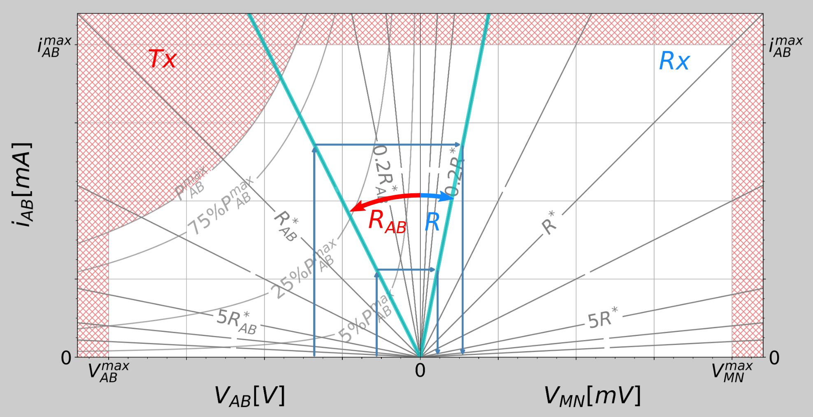

.. _strategies:

Acquisition strategies
**********************

Different acquisition strategies are available to choose the Vab to inject. These strategies operate within the instrument specifications and their results will depend on the resistance of the ground and the contact resistances. The figure below shows the space bounded by the limitations of the instruments and the environment in which the strategies operate.

	This figure shows how the Vab can be selected considering the contact resistances (`Rab`) and the ground resistance (`R`) and with constraints from the current (`Iab`), the injection voltage (`Vab`) and the measured voltage at MN (`Vmn`). Shaded red area shows the limitations of the system (Kaufmann et al., 2024).

- **vmax**:
	- Parameters: -
	- Description: Inject the largest Vab possible.
- **vmin**:
	- Parameters: `vmn_req`
	- Description: Inject smallest Vab that enables to measure the requested voltage at MN (`vmn_req`).
- **safe**:
	- Parameters: `vab_req`
	- Description: Try to inject `vab_req`. It will decrease this `vab_req` to stay within instrument limits.
- **fixed**:
	- Parameters: `vab_req`
	- Description: Inject `vab_req` without checking for instrument limitations. **This can potentially damage the board.**
- **flex**:
	- Parameters: `vab_init`, `vab_req`, `vab_min`, `vab_max`, `iab_req`, `iab_min`, `iab_max`, `vmn_req`, `vmn_min`, `vmn_max`, `pab_req`, `pab_min`, `pab_max` (all parameters are optional)
	- Description: will try to meet the requested parameter by the user.

