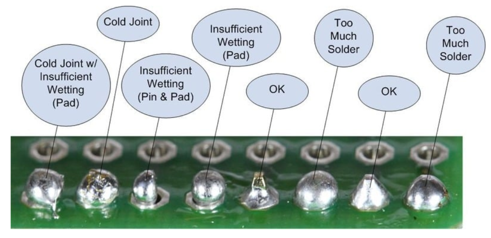
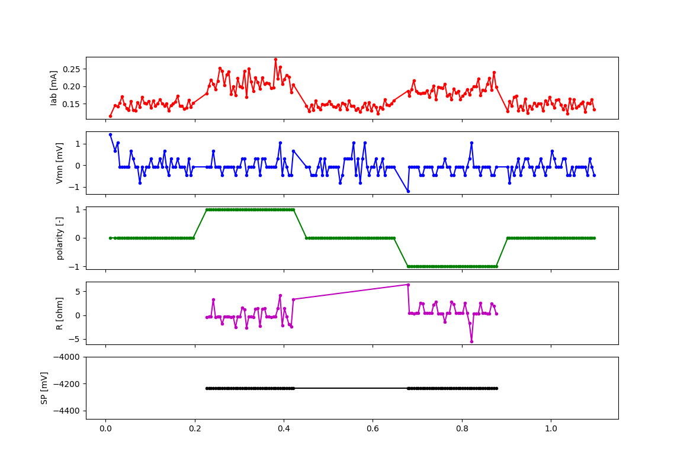
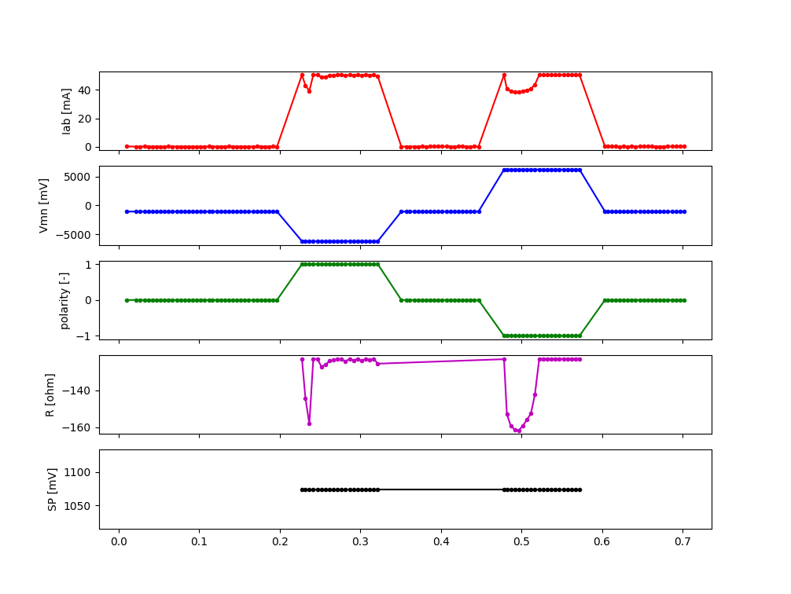
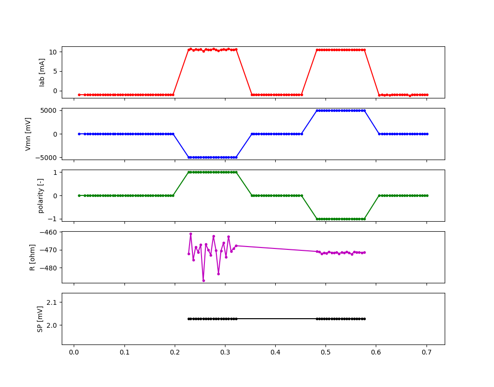
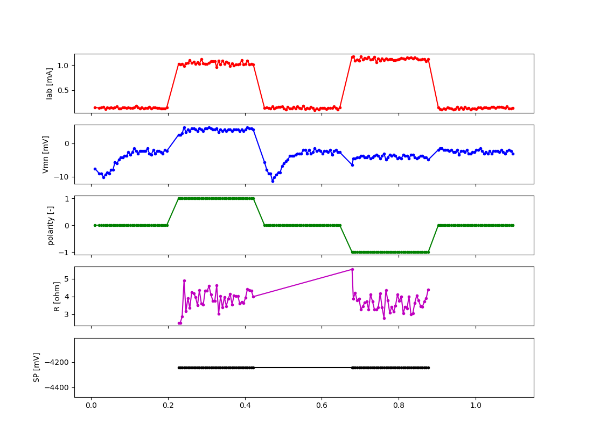
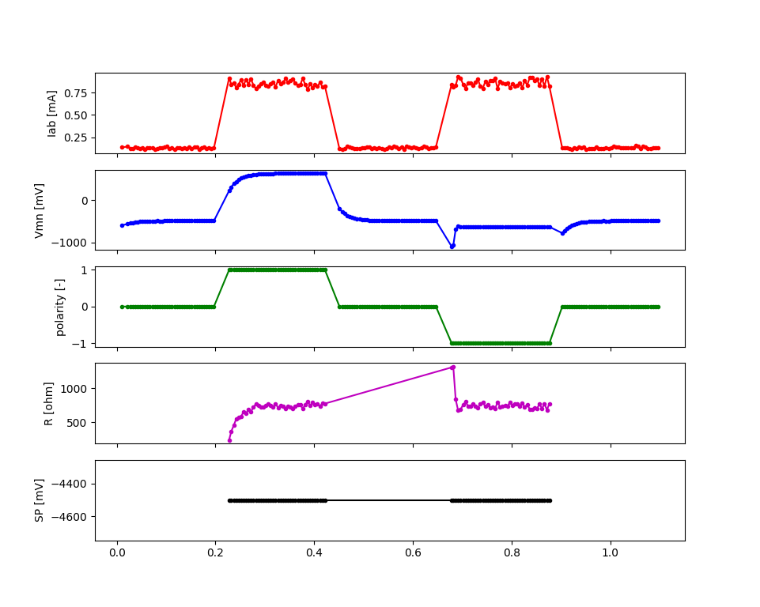
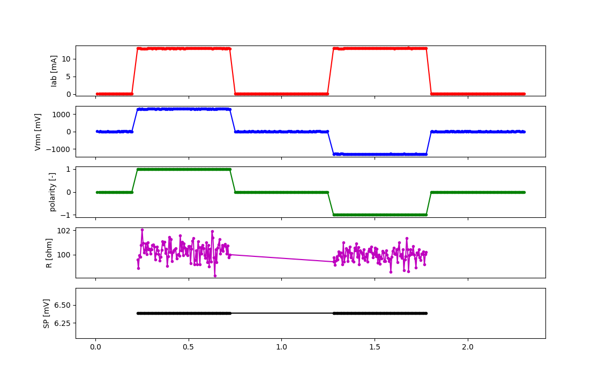
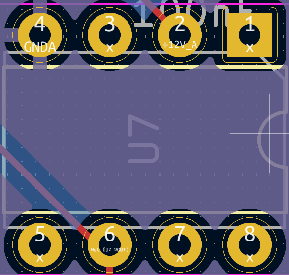
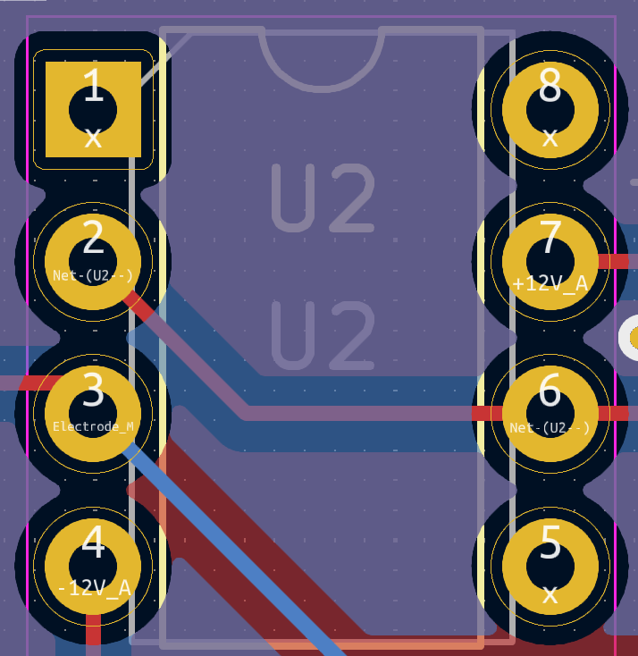
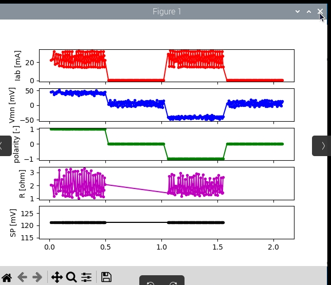

Troubleshooting
***************

We encourage users to report any issue, or bugs as an issue in the `official repository on GitLab <https://gitlab.com/ohmpi/ohmpi/-/issues>`_.
Please have a look at existing open and closed issues before posting a new one.
We have compiled here below a list of common issues and explanations on how to fix them.
For issues with the hardware, make sure your board passes the hardware checks (:ref:`mb2024-test`, :ref:`mux2024-test`).

You can also run test in the software using:

.. code-block:: python

  from ohmpi.ohmpi import OhmPi
  k = OhmPi()
  k.test()

Also make sure to check your soldering and don't hesitate to melt them again if you have a doubt, it doesn't hurt.

  source: https://www.sudomod.com/wiki/index.php/File:Bad_joints.jpg

Diagnostic with full-waveform analysis
======================================

You can always have a look at a full-waveform of a reading by doing:

.. code-block:: python

  from ohmpi.ohmpi import OhmPi
  k = OhmPi()
  k.run_measurements([1, 4, 2, 3])
  k.plot_last_fw()

This will produce a figure that will show the evolution of the voltage, current and resistance during the measure. It is helpful for diagnosing issues.

Examples of diagnostic (on a test resistor circuit).

  No current injection (relays don't open, DPH now powered or connected to screw terminal, issue with MUX, ...). Note there is always a small current (< 0.21 mA) due to the voltage bias of the current click.

  Overcurrent (max current = 4.8 (ADC range) / (2 (shunt) * 50 (current click gain)) = 48 mA). Check for shorts, decrease Vab or change strategy (use "safe" for instance).

  Overvoltage (max voltage = 5 (ADC positive range) / 2 (REF03 offset) * 2 (resistor divider) = +/- 5V). Decrease Vab or change strategy (use "safe" for instance).

  Vmn does not react to pulses. Check THD of Vmn, cable connection to electrodes.

  Vmn is not at 0 when not injecting. Check REF03 chip that provides 2.5V offset.

  Good measurement. Current is > 0.21 mA and < 48 mA. Vmn voltage reacts to pulse, is at 0 when not injecting, has a positive and negative voltage. Resistance is stable.

Communication issue between components (I2C, pull-up)
=====================================================

If you get an I2C communication error or cannot see some I2C address with `i2cdetect`.

Most components of the OhmPi communicate via I2C protocol. This protocol works with two lines (SDA and SCL) that **must be pulled-up** at rest. The pull-up resistor consists in placing a 100k (or similar values) resistor between the line and VDD (5V in this case).

Make sure you have the correct configuration for your assembled system (see :ref:`config`).
Check with the multimeter the voltage between SDA/SCL and the ground to see if it reaches 5V at rest. If it's not the case, you may need stronger pull-up (smaller value of pull-up resistor).

.. note::
	On the measurement board v2024, the I2C isolator from Mikroe, already has pull-up resistors that add to the pull-up already on the ADS1115 board. If the ADS1115 of the Vmn part cannot be seen by i2cdetect, we recommend to remove the pull-up resistors on the Mikroe I2C isolator board (see note fig29 in :ref:`mb2024-build`)

Modbus error
============

Modbus is the protocol used to communicate between the DPH5005 and the Raspberry Pi via a USB cable.
If the Pi cannot detect the DPH, a modbus error can be reported. This can have several origins:
#. Make sure that you properly modified the baud rate of the DPH to 19200 (as explained in :ref:`_power-DPH5005`)
#. Make sure the USB cable is not damaged, correctly feeding the Raspberry Pi USB port to the DPH5005
#. Make sure that the DPH can be properly powered from the TX power connectors
#. If all the above are okay, than it can also be that the DPH is not given enough time to start (latency time). This can be increased in the `config.py > HARDWARE_CONFIG > rx > latency`.

Issue with the pulses between A and B
=====================================

In the measurement board v2023, this is likely due to the optical relays not opening or closing properly. These relays are quite fragile and, from experience, are easily damaged. Check if the optical relays are still working by measuring if they are conductors when turned on using a multimeter without connecting any electrodes to A and B.

If an optical relay is broken, you will have to replace it with a new one.

In the measurement board v2024, these optical relays are replaced by mechanical relays which are more robust and should not cause any issue.

Values given are not correct
============================

One possible cause is that the **shunt resistor was burned**. Once burned, the value of the resistor is not correct anymore and we advise to change it. To see if the shunt is burned, you can measure the value of the shunt resistor to see if it still has the expected value.

Another possibility is that the MN voltage you are trying to measure is **over the range of the ADC** (+/- 4.5 V effective range for ADS1115). You can easily check that by measuring the voltage at MN with a voltmeter.

In the measurement board v2024, the current sensing part is replaced by a click board. It is possible that the shunt resistance on this click board is burned due to malfunction. In this case, an erroneous value of current will be given. The click board must be replaced to solve the issue.

See also the step by step guides below.

Incorrect current value
=======================

Current debugging:

- inject for 2 seconds and measure with the voltmeter that the given injected voltage (e.g. 12 V from Tx battery) is well found at the A-B screw terminals
  
  - OK: no problem with the relays, proceed to next step
  
  - NOT OK: possible issue with the polarity relays, the voltage source or the shunt (if shunt not soldered or burned, the current cannot pass through it)

- using a test circuit board (4 contact resistances and a target resistance directly connected to the measurement board - no multiplexer), inject a given voltage and see if you get the expected voltage drop around the shunt resistor. For instance, for a test circuit with 100 Ohm target resistor and 1000 Ohm contact resistance, the total resistance will be 1000 + 100 + 1000 + 2 (shunt resistor) = 2102 Ohms. This will mean that if we have a 12V injection voltage, we will measure: 12*2/2102 = 0.011 V around the shunt. Test that with a multimeter.
  
  - OK: you can proceed to next step
  
  - NOT OK: you possibly have extra resistance in your circuit, check soldering, make sure the relays close well (you hear them clicking)

- check the current click output voltage (AN pin). It should give 50 times the voltage around the shunt. If we measure 0.011 V around the shunt, we should see 0.55 V at the AN pin (between AN and the GND pin of the current click)
  
  - OK: the current click works as expected, proceed to next step
  
  - NOT OK: there is likely an issue with the current click, double check all soldering and modifications were done according to the documentation, without injecting, measure the voltage between AN and the GND pin, it should only show a few mV. In any other case, it means the current click is damaged and should be replaced.

- lastly, you can check that the ADS1115 (0x48) is not broken. Switch it with another working ADS and see if the problem persists or not. The voltage of the AN pin goes on the A0 pin of the ADS.

Voltage incorrect value
=======================

Vmn debugging:

- with the measurement board powered up but the MN terminal disconnected from any electrode and no injection taking place, measure the voltage between screw terminal N and ADS 0x49 (voltage ADC) A0 pin. It should be 2.5V

  - OK: you can proceed to next step

  - NOT OK: there is an issue with the chip REF03 generating the 2.5V, check its power supply. Also check the polarity of the schottky diodes in front of the ADS 0x49.

 
  Pinout of the REF03.

- connect a test resistor circuit to the measurement board (no mux) and run a long injection (2s) so you can measure the voltage at the MN terminal and compare it to what is expected. For instance, for a circuit with 1000 Ohm contact resistance, 100 Ohm target resistance and 2 Ohm shunt resistor. If we inject 12 V (=Vab), we should measure: Vmn = 12*100/(2*1000+100+2) = 0.57 V

  - OK: proceed to next step
 
  - NOT OK: check your test circuit resistance values, check if any current is actually injected in your circuit (see current debugging guide)

- still with the test resistor connected and running a long injection, measure the output voltage (with reference to terminal N) after each op-amp output (pin 6, third pin on the right from the top). If we have 0.57 V at the MN screw terminal, we expect 0.57 V at pin 6 of the first op-amp, 0.57/2 = 0.285 V at pin 6 of second op-amp and 0.285+2.5 = 2.785 V at pin 6 of third op-amp and on A0 of ADS 0x49.

  - NOT OK: check the power supply of each op-amp, it should be -12 (pin 4) and +12 (pin 7). Check all soldering and if the chips are well inserted in the sockets.

 
  Pinout of op-amp.

Resistances values are divided by 2 (mb2024)
=================================================

This can be due to a badly soldered connection between the DG411 and the MCP23008 MN or between the output pins of the DG411.
This means that the gain is not applied in the Vmn part. Use a multimeter in continuity mode to check connectivity and soldering of DG411 and MCP23008.

Noise in the Vmn and Iab signals
================================

The OhmPi does not filter the signal for 50 or 60Hz power noise. This noise can appear in the Vmn reading if the Tx or Rx battery is connected to a charger connected to the grid.
It can also appear in the field if there is an AC leakage or high voltage power lines nearby.

 
  Example of 50 Hz noise coming from a charger connected to the TX battery

To solve this, you may need to design a system that disconnects the charger (turn it off) when doing a measurement.

Unexpected electrode takeout
============================

The IDC sockets of the mux2023 and mux2024 are not wired identically. Double check that you connected the right electrode to the right ribbon cable (see drawings in the assembling tutorials)

Strong decay in current
=======================

A strong decay in current can be an indication that the battery cannot supply enough power to the DPH5005 to maintain the requested voltage.
It can also be that the injection time is too short to let the current reach steady-state. In this case, we recommend increasing the injection time.

Current max out at 48 mA
========================

By default, the measurement board (v2023 and v2024) are set up with a shunt resistor of 2 Ohms. This effectively limit the current
we can measure to 48 mA. If the data you collected show current that seems to stays close to this value, they are probably higher but the
the measurement board cannot measure them properly. Note that the shunt resistor **does not limit the current**. If a too large current goes through the
shunt resistor, it will burn and its value will not be precisely equal to 2 Ohms.

To measure larger current in the field, we recommend using other shunt resistors (e.g. 1 Ohms for max 100 mA, 0.5 Ohms for max 200 mA).
Multiple 2 Ohms shunt resistors can also be placed in parallel to decrease the shunt resistance.

OhmPi is slow
=============

One of the reasons why the OhmPi can be very slow (up to 5s between print in the command line) can be due to the MQTT broker not being found. Make sure you have set a correct hostname ('localhost' by default) in the `config.py` file.

Another reason could be because you use a 64 bit version of Raspbian. We noticed that the 32 bit version was faster. You can select the version when you install Raspbian on the SD card (see installation section).

Raspberry Pi low voltage warning
================================

The Raspberry Pi 5 needs more power than the Raspberry Pi 4 and will give a low voltage warning when used in the OhmPi as the THD-1211N does not provide enough current. It is recommended either to switch to a Raspberry Pi 4 or add an additional DC/DC converter (12V -> 5V).