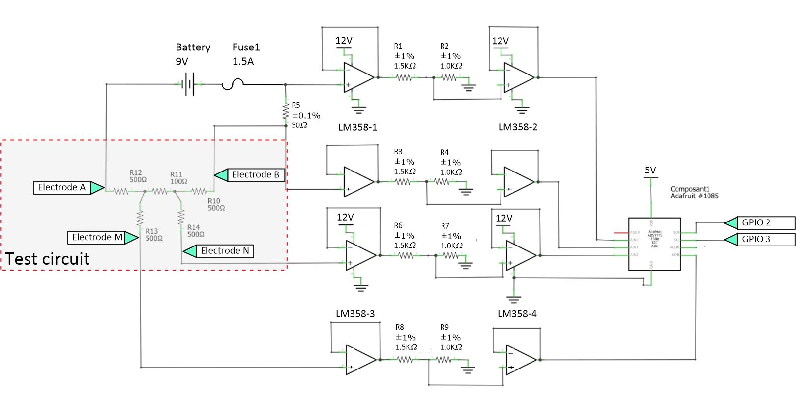

*****************************************
OhmPi V 2.xx (64 or 128 electrodes)
***************************************** 

.. figure:: Under-Construction.png
	   :width: 500px
	   :align: center
	   :height: 250px
	   :alt: Ohmpi 2
	   :figclass: align-center

.. figure:: image_ohmpi_2.jpg
	   :width: 800px
	   :align: center
	   :height: 600px
	   :alt: Ohmpi 2
	   :figclass: align-center

.. note::
	 In this version, we have developed two new board types that allow the assembly of Ohmpi v2.00, a measurement board and a multiplexer board.
	 This new version is made up of: 
	 
	 1. A measurement board for four-point measurement
	 
	 2. 4 multiplexer cards
	 
	 3. A box 

The philosophy of Ohmpi 
**************************
The philosophy of Ohmpi V2.00 is to offer a new DIY multielectrode resistivity meter. It is a resistivity meter with 64 electrodes , which can be upgraded to 128 electrodes. 
It is limited to low-current injection,but suitable for small laboratory experiments and small field time-lapse monitoring.
Ohmpi, is developed by a team that seeks to share all its experience and wishes to improve and offer a more and more robust tool to the community.Ohmpi V2.00 is a completely different version from the previous one. 
We will stop the development on the previous version, to dedicate our efforts on this new version. 

Technical data
***************

+-------------------------------+--------------------+-----------+--------------------+-----------+
| **Parameter**                 | **Specifications** | Units     | **Specifications** | Units     |
|                               |       **V1**       |           |       **V2**       |           |
+-------------------------------+--------------------+-----------+--------------------+-----------+
|Electrodes                     |32                  |           |64 to 128           |           |
+-------------------------------+--------------------+-----------+--------------------+-----------+
|Operating temperature          |-0 to 50            |°c         |-25 to 50           |°c         |
+-------------------------------+--------------------+-----------+--------------------+-----------+
|Power consumption of CPU and   |18.5                |W          |18.5                |W          |              
|control system                 |                    |           |                    |           |
+-------------------------------+--------------------+-----------+--------------------+-----------+
|Voltage injection              |12                  |V          |12                  |V          |
+-------------------------------+--------------------+-----------+--------------------+-----------+
|Battery                        |9                   |V          |12                  |V          |
+-------------------------------+--------------------+-----------+--------------------+-----------+
|Current                        |0 to 40             |mA         |0 to 40             |mA         |
+-------------------------------+--------------------+-----------+--------------------+-----------+
|Min pulse duration             |150                 |mS         |150                 |mS         |
+-------------------------------+--------------------+-----------+--------------------+-----------+
|Input impedance                |80                  |Mohm       |80                  |Mohm       |
+-------------------------------+--------------------+-----------+--------------------+-----------+
|Data storage                   |micro SD card       |           |micro SD card       |           |
+-------------------------------+--------------------+-----------+--------------------+-----------+
|Resolution                     |O.O1                |ohm        |O.O1                |ohm        |
+-------------------------------+--------------------+-----------+--------------------+-----------+

**STEP n°1** : Raspberry Pi  configuration
*******************************************

OS installation  
================

+----------------------------------------------------+---------------+
| **Required components**                            | **Quantity**  | 
+----------------------------------------------------+---------------+
|Raspberry Pi 4 Model B                              |              1|
+----------------------------------------------------+---------------+
|Micro SD 32 Go                                      |              1|
+----------------------------------------------------+---------------+
|HDMI Cable                                          |              1|
+----------------------------------------------------+---------------+
|Computer mouse                                      |              1|
+----------------------------------------------------+---------------+
|Computer Keyboard                                   |              1|
+----------------------------------------------------+---------------+

The first step is to start up the Raspberry Pi board, including installation of an OS (operating system). 
For this step, the installation instructions are well described on the Raspberry website 

1. Watch the vidéo "how to set up your raspberry Pi" (https://www.youtube.com/watch?v=wjWZhV1v3Pk)

2. The authors recommend installing the latest stable and complete version of Raspbian by using NOOBS (a simple-to-use operating system installer).

3. or you can visit this website : (https://projects.raspberrypi.org/en/projects/raspberry-pi-setting-up)  

.. note:: 
	 All the development tests were performed on Raspberry Pi 3 Model B, we used the following version of Raspbian:
	 
	 .. figure:: raspbian_version.jpg
	   :width: 800px
	   :align: center
	   :height: 400px
	   :alt: alternate text
	   :figclass: align-center

.. warning::
	 Once the OS has been installed,  **1-wire, spi and GPIO remote option** must be deactivated via the Raspbian GUI settings menu. Failure to carry out this task may cause damage to the relay shield cards during measurements.

3. When the relays are connected to the GPIO, make sure that all the GPIOs are in the low position when the raspberry starts up. If not, the relays will activate unexpectedly. 
To ensure that the GPIOs are in Low position, you will need to modify the /boot/config.txt file.

 Run the terminal, and write

 .. code-block:: python

	 cd /boot/

4. Open config.txt with GNU nano editor

 .. code-block:: python

	 sudo nano config.txt

5. At the end of the file write : 

 .. code-block:: python
	 
	 gpio=8=op,dl
	 gpio=7=op,dl

6. Press Ctrl +O to save the modifications and press enter
7. Press Ctrl +x to escap and return to the terminal
8. Close the terminal

Virtual Environnement and packages
==================================

A virtual environment is a way to have multiple, parallel instances of the Python interpreter, each with different package sets and different configurations. 
Each virtual environment contains a discrete copy of the Python interpreter, including copies of its support utilities. It also protects your system in case of problems with the packages.

All dependencies are specified in requirements.txt

.. note:: 
	 All instructions below should be typed in the terminal

It is first necessary to ensure that the libatlas-base-dev library is installed:

.. code-block:: python
	
	 sudo apt-get install libatlas-base-dev

We strongly recommend users to create a virtual environment to run the code and installed all required dependencies. It can be done either in a directory gathering all virtual environments used on the computer or within the ohmpy directory.

Create the virtual environment:

.. code-block:: python
	 
	 python3 -m venv ohmpy

Activate it using the following command:

.. code-block:: python
	 
	 source ohmpy/bin/activate

Install packages within the virtual environment. Installing the following package should be sufficient to meet dependencies:

.. code-block:: python
	 
	 pip install RPi.GPIO adafruit-blinka numpy adafruit-circuitpython-ads1x15 pandas

Check that requirements are met using 

.. code-block:: python
	 
	 pip list

You should run you code within the virtual environment
to leave the virtual environment simply type:

.. code-block:: python
	  
	 deactivate

Activate virtual environnement on Thonny (Python IDE)  (on Rapberry Pi) 
========================================================================

If you decided to use a virtual environment, it is necessary to setup Thonny Python IDE the first time you use it.

1- Run the Thonny Python IDE software, Click on raspebrry acces **menu > programming> Thonny pythonIDE**

2- Thonny's interface opens, Python runs on the Root (Python 3.7.3 (/usr/bin/python3))

.. figure:: thonny_first_interface.jpg
	   :width: 600px
	   :align: center
	   :height: 450px
	   :alt: alternate text
	   :figclass: align-center

3-Click on **Run>select interpreter**, a new window opens click on interpret

.. figure:: thonny_option.jpg
	   :width: 600px
	   :align: center
	   :height: 450px
	   :alt: alternate text
	   :figclass: align-center

4-On the new open windows select **alternative Pyhton3 or virtual environnement**

.. figure:: thonny_interpreter.jpg
	   :width: 600px
	   :align: center
	   :height: 450px
	   :alt: alternate text
	   :figclass: align-center
	   
5- New buttons appeared, selected **"locate another python executable "**

6- A new window opens, find the folder where there is the python 3 file in the virtual environment folder previously created **/home/pi/ohmpi/bin/python3**.

7- In the **known interpreter** tab the path of the virtual environnementshould appear

.. figure:: thonny_interpreter_folder.jpg
	   :width: 600px
	   :align: center
	   :height: 450px
	   :alt: alternate text
	   :figclass: align-center 

8- Close the window by clicking on **ok**.

9- Close thonny to save modifications

 
**STEP n°2**: Assembly of the measurement board
****************************************************

+----------------------------------------------------+
| **Required components**                            | 
+----------------------------------------------------+

.. figure:: step_n_2/00_mes_board_components.jpg       
	   :width: 600px
	   :align: center
	   :height: 450px
	   :alt: alternate text
	   :figclass: align-center 

.. csv-table:: List of components
   :file: C:\Users\remi.clement\Documents\28_ohmpi_all_git\master2\sphinx\source\step_n_2\Mesure_board_list_2_xx.csv
   :widths: 30, 70, 70, 70, 70, 35, 35
   :header-rows: 1
   
Description
==========================================   

Figure  shows the general schematics for the electronic measurement board developed.
We have developed a complete "plug and play" measurement board. To measure electrical resistivity with Raspberry Pi. 
two ADS1115 were used,one for the voltage measurement one for the current measurement, as proposed by Florsch [7]. The ADS1115
is a 16-bit ADC (Analog-to-Digital Converter), with an adaptable gain. The advantage of ADS1115 is that the 
input signal value could lie between - to + 6.114 V. For the current measurement we have directly integrated the INA282 component, 
which allows to realize precise current measurement around a shunt resistor. The assembly steps are described in the following steps:

.. table::
   :align: center
   
   +--------+------------------------------------------------------------+
   |        |   .. image:: step_n_2/01_mes_board.jpg                     |
   |      1 +------------------------------------------------------------+
   |        | Installation of female header, 1 by10  pins, for ADS1115   | 
   |        |                                                            |                                                                       
   +--------+------------------------------------------------------------+
   
.. table::
   :align: center
  
   +--------+------------------------------------------------------------+
   |        |   .. image:: step_n_2/02_mes_board.jpg                     |
   |2       +------------------------------------------------------------+
   |        | Soldering of 4 dual-in-line- socket (2 by 2 pins) for      | 
   |        | optical relay, AQY211EH.                                   |                                                                       
   +--------+------------------------------------------------------------+
   
.. table::
   :align: center
  
   +--------+------------------------------------------------------------+
   |        |   .. image:: step_n_2/03_mes_board.jpg                     |
   |3       +------------------------------------------------------------+
   |        | Soldering of 1 dual-in-line- socket (2 by 9 pins)          | 
   |        | for INA282.                                                |                                                                       
   +--------+------------------------------------------------------------+
   
.. table::
   :align: center
  
   +--------+------------------------------------------------------------+
   |        |   .. image:: step_n_2/04_mes_board.jpg                     |
   | 4      +------------------------------------------------------------+
   |        | Soldering of 1 dual-in-line- socket (2 by 4 pins)          | 
   |        |                                                            |                                                                       
   +--------+------------------------------------------------------------+ 
.. table::
   :align: center
  
   +--------+------------------------------------------------------------+
   |        |   .. image:: step_n_2/05_mes_board.jpg                     |
   |5       +------------------------------------------------------------+
   |        | Soldering of 2 dual-in-line- socket (2 by 4 pins)          | 
   |        |                                                            |                                                                       
   +--------+------------------------------------------------------------+
   
.. table::
   :align: center
  
   +--------+------------------------------------------------------------+
   |        |   .. image:: step_n_2/06_mes_board.jpg                     |
   | 6      +------------------------------------------------------------+
   |        | Traco Power Supply 12V to 5V, TDH15 - 1211N                | 
   |        |                                                            |                                                                       
   +--------+------------------------------------------------------------+  

.. table::
   :align: center
  
   +--------+------------------------------------------------------------+
   |        |   .. image:: step_n_2/07_mes_board.jpg                     |
   |7       +------------------------------------------------------------+
   |        | Four screw terminals for 12V inpout et 5V outpout          | 
   |        |                                                            |                                                                       
   +--------+------------------------------------------------------------+
   
.. table::
   :align: center
  
   +--------+------------------------------------------------------------+
   |        |   .. image:: step_n_2/08_mes_board.jpg                     |
   |8       +------------------------------------------------------------+
   |        | Traco power Supply 12V to 24V, TRN-1215                    | 
   |        |                                                            |                                                                       
   +--------+------------------------------------------------------------+    

.. table::
   :align: center
  
   +--------+------------------------------------------------------------+
   |        |   .. image:: step_n_2/09_mes_board.jpg                     |
   |9       +------------------------------------------------------------+
   |        | Two screw terminals electrodes M and N                     | 
   |        |                                                            |                                                                       
   +--------+------------------------------------------------------------+
   
.. table::
   :align: center
  
   +---------+------------------------------------------------------------+
   |         |   .. image:: step_n_2/10_mes_board.jpg                     |
   |10       +------------------------------------------------------------+
   |         | Four screw terminals, for 12V power supply and for         | 
   |         | electrodes A and B                                         |                                                                       
   +---------+------------------------------------------------------------+

.. table::
   :align: center
  
   +---------+------------------------------------------------------------+
   |         |   .. image:: step_n_2/11_mes_board.jpg                     |
   |11       +------------------------------------------------------------+
   |         |  Soldering three capacitors (100nF)                        | 
   |         |                                                            |                                                                       
   +---------+------------------------------------------------------------+
   
.. table::
   :align: center
  
   +---------+------------------------------------------------------------+
   |         |   .. image:: step_n_2/12_mes_board.jpg                     |
   | 12      +------------------------------------------------------------+
   |         | 2 ohms shunt resistor pre-adjustment                       | 
   |         |                                                            |                                                                       
   +---------+------------------------------------------------------------+
.. table::
   :align: center
  
   +---------+------------------------------------------------------------+
   |         |   .. image:: step_n_2/13_mes_board.jpg                     |
   |13       +------------------------------------------------------------+
   |         | Soldering 2 ohms shunt resistor                            | 
   |         |                                                            |                                                                       
   +---------+------------------------------------------------------------+
   
.. table::
   :align: center
  
   +---------+------------------------------------------------------------+
   |         |   .. image:: step_n_2/14_mes_board.jpg                     |
   |14       +------------------------------------------------------------+
   |         | 1 Mohms resistors                                          | 
   |         |                                                            |                                                                       
   +---------+------------------------------------------------------------+  
   
.. table::
   :align: center
  
   +---------+------------------------------------------------------------+
   |         |   .. image:: step_n_2/15_mes_board.jpg                     |
   |15       +------------------------------------------------------------+
   |         | Soldering tow 1 Kohms resistors                            | 
   |         |                                                            |                                                                       
   +---------+------------------------------------------------------------+
   
.. table::
   :align: center
  
   +---------+------------------------------------------------------------+
   |         |   .. image:: step_n_2/16_mes_board.jpg                     |
   |16       +------------------------------------------------------------+
   |         | Soldering tow 1.5Kohms resistors                           | 
   |         |                                                            |                                                                       
   +---------+------------------------------------------------------------+
.. table::
   :align: center
  
   +---------+------------------------------------------------------------+
   |         |   .. image:: step_n_2/17_mes_board.jpg                     |
   |17       +------------------------------------------------------------+
   |         | Soldering tow 1.5Kohms resistors                           | 
   |         |                                                            |                                                                       
   +---------+------------------------------------------------------------+
   
.. table::
   :align: center
  
   +---------+------------------------------------------------------------+
   |         |   .. image:: step_n_2/18_mes_board.jpg                     |
   |18       +------------------------------------------------------------+
   |         | Female header 2 by 20 pins for Raspberry Pi connection     | 
   |         |                                                            |                                                                       
   +---------+------------------------------------------------------------+

.. table::
   :align: center
  
   +---------+------------------------------------------------------------+
   |         |   .. image:: step_n_2/19_mes_board.jpg                     |
   |19       +------------------------------------------------------------+
   |         | View of the female  header 2 by 20 pins installation       | 
   |         | for Raspberry Pi connection                                |                                                                       
   +---------+------------------------------------------------------------+
   
.. table::
   :align: center
  
   +---------+------------------------------------------------------------+
   |         |   .. image:: step_n_2/20_mes_board.jpg                     |
   |20       +------------------------------------------------------------+
   |         | Fixing MCP23008 component                                  | 
   |         |                                                            |                                                                       
   +---------+------------------------------------------------------------+
   
.. table::
   :align: center
  
   +---------+------------------------------------------------------------+
   |         |   .. image:: step_n_2/21_mes_board.jpg                     |
   |21       +------------------------------------------------------------+
   |         |Mounting optical relay, AQY211EH                            | 
   |         |                                                            |                                                                       
   +---------+------------------------------------------------------------+
   
.. table::
   :align: center
  
   +---------+------------------------------------------------------------+
   |         |   .. image:: step_n_2/22_mes_board.jpg                     |
   |22       +------------------------------------------------------------+
   |         | Mounting LM158 operational amplificator                    | 
   |         |                                                            |                                                                       
   +---------+------------------------------------------------------------+

.. table::
   :align: center
  
   +---------+------------------------------------------------------------+
   |         |   .. image:: step_n_2/23_mes_board.jpg                     |
   |23       +------------------------------------------------------------+
   |         |  Mounting ADS115 board                                     | 
   |         |                                                            |                                                                       
   +---------+------------------------------------------------------------+
   
.. table::
   :align: center
  
   +---------+------------------------------------------------------------+
   |         |   .. image:: step_n_2/24_mes_board.jpg                     |
   |24       +------------------------------------------------------------+
   |         | Fixing the INA282                                          | 
   |         |                                                            |                                                                       
   +---------+------------------------------------------------------------+
  
  

**STEP n°3**: Start-up of the measurement board.
****************************************************

+------------------------------------------------------------------------+
| **Required components**                                                | 
+------------------------------------------------------------------------+

.. csv-table:: List of components
   :file: C:\Users\remi.clement\Documents\28_ohmpi_all_git\master2\sphinx\source\step_n_3\test_2_xx.csv
   :widths: 30, 70, 70, 70, 70, 35, 35
   :header-rows: 1

.. table::
   :align: center
   
   +--------+------------------------------------------------------------+
   |        |   .. image:: step_n_3/001.jpg                              |
   |Step n°1+------------------------------------------------------------+
   |        | Shutdown the raspberry Pi and unplug the power supply      | 
   |        |                                                            |                                                                       
   +--------+------------------------------------------------------------+
   
.. table::
   :align: center
   
   +--------+--------------------------------------------------------------------------+
   |        |   .. image:: step_n_3/001.jpg                                            |
   |Step n°2+--------------------------------------------------------------------------+
   |        | Mounting the bottom spacers on the Raspberry Pi (male/female, 11mm, M3)  | 
   |        |                                                                          |                                                                       
   +--------+--------------------------------------------------------------------------+

.. table::
   :align: center
   
   +--------+--------------------------------------------------------------------------+
   |        |   .. image:: step_n_3/002.jpg                                            |
   |Step n°3+--------------------------------------------------------------------------+
   |        | Mounting the upper spacers on the Raspberry Pi (female/female, 11mm, M3) | 
   |        |                                                                          |                                                                       
   +--------+--------------------------------------------------------------------------+

.. table::
   :align: center
   
   +--------+------------------------------------------------------------+
   |        |   .. image:: step_n_3/003.jpg                              |
   |Step n°4+------------------------------------------------------------+
   |        | Mounting the Ohmpi's measurement board on the Raspberry Pi | 
   |        |                                                            |                                                                       
   +--------+------------------------------------------------------------+

.. table::
   :align: center
   
   +--------+------------------------------------------------------------+
   |        |   .. image:: step_n_3/004.jpg                              |
   |Step n°4+------------------------------------------------------------+
   |        | Mounting the Ohmpi's measurement board on the Raspberry Pi | 
   |        |                                                            |
   +--------+------------------------------------------------------------+   

.. table::
   :align: center
   
   +--------+------------------------------------------------------------+
   |        |   .. image:: step_n_3/005.jpg                              |
   |Step n°5+------------------------------------------------------------+
   |        | Plug the power supply into a socket and connect it to your | 
   |        | Raspberry Pi's power port.                                 |
   +--------+------------------------------------------------------------+  

**STEP n°4**: Measurement board validation
****************************************************

 Run the terminal, and write

 .. code-block:: python

	 i2cdetect -y 1

.. table::
   :align: center
   
   +--------+------------------------------------------------------------+
   |        |   .. image:: step_n_3/005.jpg                              |
   |Step n°3+------------------------------------------------------------+
   |        | Montage des écarteurs supérieurs sur la carte Raspberry    | 
   |        |                                                            |                                                                       
   +--------+------------------------------------------------------------+

