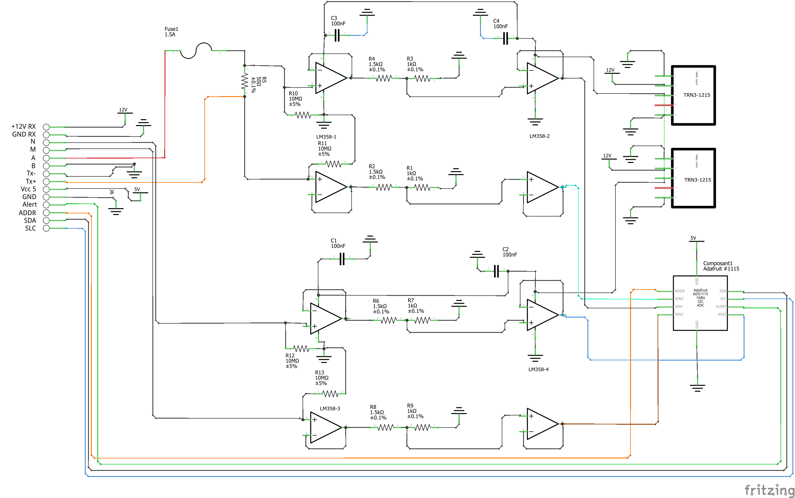
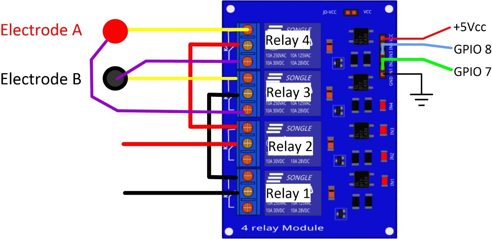
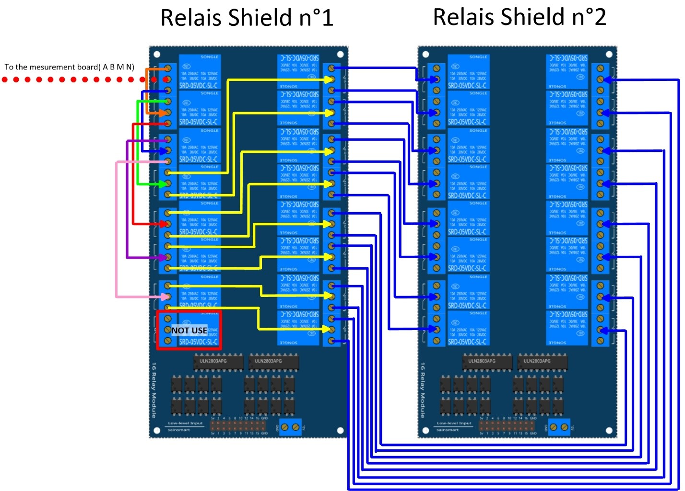

*****************************************
OhmPi V 2.00 (64 or 128 électrodes)
***************************************** 

.. note::
	 
	 In this version, we have improved the electronic measurement board. To upgrade from version 1.01 to 1.02, 
	 you just have to replace the measurement board by the new one proposed here.

The philosophy of Ohmpi 
**************************
The philosophy of Ohmpi V1.01 is to offer a multi electrode resistivity meter, from a set of commercially available 
electronic cards it is a resistivity meter limited to 32 electrodes only. It is limited to low-current injection, 
but suitable for small laboratory experiments and small field time monitoring

Technical data
***************
+-------------------------------+--------------------+-----------+
| **Parameter**                 | **Specifications** | Units     |
+-------------------------------+--------------------+-----------+
|Electrodes                     |32                  |           |
+-------------------------------+--------------------+-----------+
|Operating temperature          |0 to 50             |°c         |
+-------------------------------+--------------------+-----------+
|Power consumption of CPU and   |18.5                |W          |             
|control system                 |                    |           |
+-------------------------------+--------------------+-----------+
|Voltage injection              |9                   |V          |
+-------------------------------+--------------------+-----------+
|Battery                        |12                  |V          |
+-------------------------------+--------------------+-----------+
|Current                        |0 to 50             |mA         |
+-------------------------------+--------------------+-----------+
|Min pulse duration             |150                 |mS         |
+-------------------------------+--------------------+-----------+
|Input impedance                |36                  |Mohm       |
+-------------------------------+--------------------+-----------+
|Data storage                   |micro SD card       |           |
+-------------------------------+--------------------+-----------+
|Resolution                     |O.O1                |ohm        |
+-------------------------------+--------------------+-----------+

Raspberry Pi  configuration
****************************************** 
OS installation  
================

The first step is to start up the Raspberry Pi board, including installation of an OS (operating system). 
For this step, the installation instructions are well described on the Raspberry website 

1. Watch the vidéo "how to set up your raspberry Pi" (https://www.youtube.com/watch?v=wjWZhV1v3Pk)

2. The authors recommend installing the latest stable and complete version of Raspbian by using NOOBS (a simple-to-use operating system installer). 

.. note:: 
	 All the development tests were performed on Raspberry Pi 3 Model B, we used the following version of Raspbian:
	 
	 .. figure:: raspbian_version.jpg
	   :width: 800px
	   :align: center
	   :height: 400px
	   :alt: alternate text
	   :figclass: align-center

.. warning::
	 Once the OS has been installed,  **1-wire, spi and GPIO remote option** must be deactivated via the Raspbian GUI settings menu. Failure to carry out this task may cause damage to the relay shield cards during measurements.

3. When the relays are connected to the GPIO, make sure that all the GPIOs are in the low position when the raspberry starts up. If not, the relays will activate unexpectedly. 
To ensure that the GPIOs are in Low position, you will need to modify the /boot/config.txt file.

 Run the terminal, and write

 .. code-block:: python

	 cd /boot/

4. Open config.txt with GNU nano editor

 .. code-block:: python

	 sudo nano config.txt

5. At the end of the file write : 

 .. code-block:: python
	 
	 gpio=8=op,dl
	 gpio=7=op,dl

6. Press Ctrl +O to save the modifications and press enter
7. Press Ctrl +x to escap and return to the terminal
8. Close the terminal

Virtual Environnement and packages
==================================

All dependencies are specified in requirements.txt

.. note:: 
	 All instructions below should be typed in the terminal

It is first necessary to ensure that the libatlas-base-dev library is installed:

.. code-block:: python
	
	 sudo apt-get install libatlas-base-dev

We strongly recommend users to create a virtual environment to run the code and installed all required dependencies. It can be done either in a directory gathering all virtual environments used on the computer or within the ohmpy directory.

Create the virtual environment:

.. code-block:: python
	 
	 python3 -m venv ohmpy

Activate it using the following command:

.. code-block:: python
	 
	 source ohmpy/bin/activate

Install packages within the virtual environment. Installing the following package should be sufficient to meet dependencies:

.. code-block:: python
	 
	 pip install RPi.GPIO adafruit-blinka numpy adafruit-circuitpython-ads1x15 pandas

Check that requirements are met using 

.. code-block:: python
	 
	 pip list

You should run you code within the virtual environment
to leave the virtual environment simply type:

.. code-block:: python
	  
	 deactivate

Activate virtual environnement on Thonny (Python IDE)  (on Rapberry Pi) 
========================================================================

If you decided to use a virtual environment, it is necessary to setup Thonny Python IDE the first time you use it.

1- Run the Thonny Python IDE software, Click on raspebrry acces **menu > programming> Thonny pythonIDE**

2- Thonny's interface opens, Python runs on the Root (Python 3.7.3 (/usr/bin/python3))

.. figure:: thonny_first_interface.jpg
	   :width: 600px
	   :align: center
	   :height: 450px
	   :alt: alternate text
	   :figclass: align-center

3-Click on **Run>select interpreter**, a new window opens click on interpret

.. figure:: thonny_option.jpg
	   :width: 600px
	   :align: center
	   :height: 450px
	   :alt: alternate text
	   :figclass: align-center

4-On the new open windows select **alternative Pyhton3 or virtual environnement**

.. figure:: thonny_interpreter.jpg
	   :width: 600px
	   :align: center
	   :height: 450px
	   :alt: alternate text
	   :figclass: align-center
	   
5- New buttons appeared, selected **"locate another python executable "**

6- A new window opens, find the folder where there is the python 3 file in the virtual environment folder previously created **/home/pi/ohmpi/bin/python3**.

7- In the **known interpreter** tab the path of the virtual environnementshould appear

.. figure:: thonny_interpreter_folder.jpg
	   :width: 600px
	   :align: center
	   :height: 450px
	   :alt: alternate text
	   :figclass: align-center 

8- Close the window by clicking on **ok**.

9- Close thonny to save modifications

 
Assembly of the measuring/current injection cards, and connection with the Raspberry Pi
***************************************************************************************** 

Electrical resistivity measurements board
==========================================

a) Description
-----------------------------

To measure electrical resistivity with Raspberry Pi, an ADS1115 was introduced, as proposed by Florsch [7]. The ADS1115
is a 16-bit ADC (Analog-to-Digital Converter), with an adaptable gain. Its value has been set at 2/3 in this study. The 
input signal value could lie between - to + 6.114 V. The ADS1115 is mounted on a board adapted from an in-house design. 
Figure 5 shows the general diagram for the electronic measurement board developed. This figure also displays the test 
circuit used to test the board in the laboratory, which mimics the behavior of a soil subjected to current injection. 
In this test circuit, resistance R11 represents the soil resistance.
Soil resistance R11 is connected to electrodes A and B for the current injection. Resistors R10 and R12 constitute 
the contact resistances between soil and electrodes; they are typically made of stainless steel. The battery, which 
allows for direct current injection, is connected in series with resistors R10, R11 and R12. In this part of the board, 
resistance R9 has been added to measure the current flowing between electrodes A and B. This resistance value has been 
set at 50 ohms in order to ensure:
•	a precise resistance,
•	a resistance less than the sum of resistors R10, R11 and R12; indeed, R10 and R12 generally lie between 100 and 5,000 ohms.
To measure the current intensity between A and B, the electrical potential difference at the pole of the reference resistor (R9) 
is measured. The intensity (in mA) is calculated by inserting the resulting value into the following: ?
To measure the potential difference needed to measure current intensity, the ADS 1115 is connected to the ground of the circuit. 
In our case, the ground reference is electrode B. The analog inputs A1 and A0 of the ADS1115 are connected to each pole of the 
reference resistor (R9). In order to increase input impedance and adapt the signal gain, tracking amplifiers have been included 
and completed by a divider bridge (R5, R8, R6 and R7) located between the two amplifiers. The resistance of the divider bridge 
ensures that the signal remains between 0 and 5 V, in accordance with the ADS1115 signal gain. To measure the potential difference, 
the M and N electrodes are connected to analog inputs A2 and A3 of the ADS 1115. Between the ADC and the electrodes, two tracking 
amplifiers and a divider bridge have been positioned so as to obtain a potential lying within the 0-5 V range at the analog input of the ADS 1115.
Let's note that the potential difference value would equal the potential measured with ADS1115 multiplied by the voltage reduction
value of the divider bridge (see Section 5.2). Despite the use of high-resolution resistance (i.e. accurate to within 1%), it is
still necessary to calibrate the divider bridge using a precision voltmeter. For this purpose, the input and output potentials 
of the divider bridge must be measured using an equivalent circuit for various electrical potential values. These values serve 
to calculate the gain. With this electronic board, it is possible to measure the potential and intensity without disturbing the 
electric field in the ground, with the total input impedance value being estimated at 36 mega-ohms.
A shortcut between Electrodes A and B will generate excessive currents, whose intensities depend on the type of battery used. 
A lithium ion battery or automobile-type lead-acid battery can deliver a strong enough current to damage the board and, as such, 
constitutes a potential hazard. We therefore recommend adding a 1.5-A fuse between the battery and resistor R9.
In version 1.02, we have improved the electronic board of measurement. we have added a DC/DC converter to supply the operational amplifiers 
(2 Traco power DC/DCconverter TRN3-1215). These converters allow to limit the suppression of the signal when the injected voltage is higher than 10V.
We also added 4 capacitors on the +12v inputs of the fast operational amplifiers. These are decoupling capacitors (typically 100nF ceramic) 
between each power supply terminal and ground. The last point, we have added a four very high resistances of 10 MOhm, between the ground and 
the signal input on the operational amplifiers. This prevents the operational amplifiers from overheating.

   
   Measurement board (Ohmpi version 1.02)
   
.. note::
	 If you want to have very accurate measurements you can replace the resistors with a tolerance of 1% by resistors with a tolerance of 0.01% which will improve the measurement, but the cost will be higher.
   
   
   
b) Implementation
--------------------------------
The measurement board must be printed using the PCB file (Source file repository), with components soldered onto 
it by following the steps described below and illustrated in the following figure :

* Step no. 1: test divider bridge
     For each measurement channel, we have installed a bridge divider, it is necessary to test with ohmmeter the value of the resistances, to adjust  each coefficients (coef_p0, coef_p1, coef_p2, coef_p3) in the Ohmpi.py code..

	.. math::
		coeff po = (R1 + R2) / R1
		
	.. math::	
		coeff p1 = (R3 + R4) / R3
		
	.. math::	
		coeff p2 = (R7 + R6) / R7
		
	.. math::
		coeff p3 = (R9 + R8) / R9
		
	.. code-block:: python
		:linenos:
		:lineno-start: 36

		 """
		 hardware parameters
		 """
		 R_ref = 50 # reference resistance value in ohm
		 coef_p0 = 2.5 # slope for current conversion for ADS.P0, measurement in V/V
		 coef_p1 = 2.5 # slope for current conversion for ADS.P1, measurement in V/V
		 coef_p2 = 2.5 # slope for current conversion for ADS.P2, measurement in V/V
		 coef_p3 = 2.5 # slope for current conversion for ADS.P3, measurement in V/V

	The coefficient parameters can be adjusted in lines 40 to 43 of the ohmpi.py code.	

* Step no. 2: installation of the 1-Kohm resistors with an accuracy of ± 1% (b-in the figure). 
* Step no. 3: installation of the 1.5-Kohm resistors with an accuracy of ± 1%(C-in the figure). 
* Step no. 4: installation of both the black female 1 x 10 header and the 7-blue screw terminal blocks (c-in the figure)
* Step no. 5: installation of the 50-Ohm reference resistor ± 0.1%, please check the value and correct the line 39 in ohmpi.py code (d-in the figure)
* Step no. 6: addition of both the ADS115 directly onto the header (pins must be plugged according to the figure) and the LM358N operational amplifiers (pay attention to the orientation) (e-in the figure).
* Step no. 7: installation of the 10-Mohm resistors with an accuracy of ± 5% (f-in the figure). 
* Step no. 8: installation of the two DC/DC converter TRN3-1215 (h-in the figure).
* Setp no. 9: installation of the four capacitor on 100-nF/50vDC and the fuse of 10-A (h-in the figure).
 
1-Kohm and 1.5-Kohm resistors apply to the divider bridge. If, for example, you prefer using a stronger power supply, it would be possible to adjust the divider bridge value by simply modifying these resistors. 
Once all the components have been soldered together, the measurement board can be connected to the Raspberry Pi and the 
battery terminal, according to Figure 9. Between the battery and the TX+ terminal of the measurement board, remember to 
place a fuse holder with a 1.5-A fuse for safety purposes.

.. figure:: measurement_board1-02.jpg
   :width: 800px
   :align: center
   :height: 700px
   :alt: alternate text
   :figclass: align-center

   Measurement circuit board assembly: a) printed circuit board, b) adding the 1-Kohm resistors ± 1%, c)adding the 1.5-Kohm resistors ± 1%, d) adding the black female 1 x 10 header and the 7-blue screw terminal block(2 pin, 3.5-mm pitch), e) adding the 50-ohm reference resistor ± 0.1%, and f) adding the ADS1115 and the LM358N low-power dual operational amplifiers
   
.. figure:: measurement_board-2-V1-02.jpg
   :width: 800px
   :align: center
   :height: 700px
   :alt: alternate text
   :figclass: align-center
   
   Measurement board installation with Raspberry Pi
   
Current injection board
=======================

To carry out the electrical resistivity measurement, the first step consists of injecting current into the ground.
In our case, a simple 9-V lead-acid battery is used to create an electrical potential difference that results 
in current circulating into the ground. The current is injected through electrodes A and B (see Fig. 2). This 
injection is controlled via a 4-channel relay module board connected to the Raspberry Pi. The mechanical relay
module board is shown in Figure 4. Relays 1 and 2 serve to switch on the current source. The common contacts 
of relays 1 and 2 are connected to the positive and negative battery poles, respectively. The normally open 
contacts of both relays are connected to the common contacts of relays 3 and 4. Relays 1 and 2 are connected 
to the GPIO 7 on the Raspberry Pi and therefore activate simultaneously. The role of relays 3 and 4 is to reverse 
the polarity at electrodes A and B. Thus, when relays 3 and 4 are energized by the GPIO 8 in the open position, 
the positive battery pole is connected to electrode A and the negative pole to electrode B. When not energized, 
they remain in the normally closed position. This set-up offers a simple and robust solution to inject current.

   
   Wiring of the 4-channel relay module board for current injection management

The next step consists of featuring the 4-channel relay module used for current injection and its assembly. The wiring
between the relays must be carried out in strict accordance with Fig. 10. This card must then be connected to the Raspberry
Pi and the measurement card. On the Raspberry Pi, it is necessary to connect inputs In1 and In2 to the same GPIO. For this
purpose, it is necessary to solder together the two pins on the 4-channel relay shield module and connect them to the Raspberry Pi GPIO-7 (Fig. 10). The same must be performed for inputs In3 and In4 with GPIO-8. Connect the GND and 5Vdc pins of
the relay card’s 4 channels respectively to the GND pin and 5Vcc of the Raspberry Pi. Now connect relays 1, 2, 3 and 4, as
shown in the diagram, using 1-mm2 cables (red and black in Fig. 10). Lastly, connect the inputs of relay 1 and 2 respectively
to terminals B and A of the measurement board.   

.. figure:: installation_current_board_1_02.jpg
   :width: 800px
   :align: center
   :height: 700px
   :alt: alternate text
   :figclass: align-center
   
   Current injection board installation with Raspberry Pi
   
   
Congratulations, you have build a 4 electrodes resistivity-meter.

Frist four electrodes resistivity mesurement 
============================================

Under construction !

Describe the way to valide the first part of the instruction.
Electrical resistivity measurement on test circuit

   
Multiplexer implentation
*************************
The resistivity measurement is conducted on four terminals (A, B, M and N). The user could perform each measurement 
by manually plugging four electrodes into the four channel terminals. In practice, ERT requires several tens or thousands 
of measurements conducted on different electrode arrays. A multiplexer is therefore used to connect each channel to one of 
the 32 electrodes stuck into the ground, all of which are connected to the data logger.

We will describe below how to assemble the four multiplexers (MUX), one per terminal. A multiplexer consists of 2 relay 
modules with 16 channels each. On the first board, on each MUX, 15 relays out of the 16 available will be used. Please note that the suggested 
configuration enables making smaller multiplexers (8 or 16 electrodes only). On the other hand, if you prefer upping to 64 electrodes, 
which is entirely possible, a GPIO channel multiplier will have to be used. 
To prepare the multiplexer, the channels of the two relay boards must be connected according to the wiring diagram shown below.

   
   Schematic diagram of the wiring of two 16-channel relay shields

   
For this purpose, 0.5-mm² cables with end caps are used and their length adjusted for each connection in order to produce a clean assembly. 
The length was adjusted so that the distance between the two points to be connected could be directly measured on the board once they had 
been assembled one above the other, in adding an extra 3 cm. The wires at the ends need to be stripped and the end caps added. 
As a final step, connect the cables to the correct connectors. This operation must be repeated in order to carry out all the wiring shown in Figure below.

Once the operation has been completed, the 16 control pins of each 16-channel relay shield card must be prepared. Each card actually contains 16 input channels
for activating each relay (Fig. 12). However, we will be activating several relays with a single GPIO (to limit the number of GPIOs used on Raspberry Pi,
see Section 2.4). To execute this step, it will be necessary to follow the protocol presented in Figure.
 
 .. figure:: connection.jpg
   :width: 800px
   :align: center
   :height: 400px
   :alt: alternate text
   :figclass: align-center
   
   Connection to the 16-channel relay shield
 
For the 16-channel relay shield no. 1, these steps must be followed:
*	Position a test circuit with 10 horizontal and 10 vertical holes on the pins of the 16-channel relay shield board.
*	Follow the diagram and solder the pins as shown in Fig.
*	Lastly, solder 0.5-mm² wires 1 m in length to the test circuit.

For relay shield no. 2, follow the same procedure, but solder all the pins together (d-e-f).
This same operation must be repeated for the other three multiplexers as well.
The next step consists of connecting the relay card inputs to the Raspberry Pi according to Table 5 for all four multiplexers.

+-------------------------------+-------------------------------------------+---------------------+
|                               |Relay shield n°1                           |Relay Shield n°2     |                      
|                               +----------+----------+----------+----------+---------------------+
|                               |Pin 1     |Pin 2-3   |Pin 4-7   |Pin 8-16  |Pin 1- 16            |
+-------------------------------+----------+----------+----------+----------+---------------------+
| Multiplexer A                 |12        |16        |20        |21        |26                   |
+-------------------------------+----------+----------+----------+----------+---------------------+
| Multiplexer B                 |18        |23        |24        |25        |19                   |
+-------------------------------+----------+----------+----------+----------+---------------------+
| Multiplexer M                 |06        |13        |04        |17        |27                   |
+-------------------------------+----------+----------+----------+----------+---------------------+
| Multiplexer N                 |22        |10        |09        |11        |05                   |
+-------------------------------+----------+----------+----------+----------+---------------------+
    
	Connection of the GPIOs to each multiplexer

Electrode connection
*************************
At this point, all that remains is to connect the electrodes of each multiplexer to a terminal block (Fig. 13). In our set-up, screw terminals assembled on a din rail were used. 
According to the chosen multiplexer configuration, all the relays of each multiplexer will be connected to an electrode and, consequently, each electrode will have four incoming 
connections. Instead of having four cables connecting an electrode terminal to each multiplexer, we recommend using the cable assembly shown in the following Figure.

.. figure:: cable.jpg
   :width: 800px
   :align: center
   :height: 300px
   :alt: alternate text
   :figclass: align-center
   
   Wire cabling for multiplexer and terminal screw connection

the next figure provides an example of multiplexer relay connections for electrode no. 1: this electrode of multiplexer MUX A must be connected to electrode no. 1 of MUX B. Moreover, electrode no. 1 of MUX B 
must be connected to electrode no. 1 of MUX N, which in turn must be connected to electrode no. 1 of MUX M. Lastly, electrode no. 1 of MUX M is connected to the terminal block. 
This operation must be repeated for all 32 electrodes.

.. figure:: electrode_cable.jpg
   :width: 800px
   :align: center
   :height: 800px
   :alt: alternate text
   :figclass: align-center
   
   Example of a multiplexer connection to the screw terminal for electrode no. 1.
 
.. warning::
	The 16 channel relay cards exist in 5-V and 12-V , in the bottom figure we have 12-V cards that we will directly connect to the battery.
	In case you bought 16 channel relay 5-V cards, you will need to add a DC/DC 12-V/5-V converter. You can use a STEP DOWN MODULE DC-DC (Velleman WPM404) and set the voltage to 5V with the potentiometer.

Operating instruction
*************************

Preliminary procedure (Only for the initial operation)
======================================================
The open source code must be downloaded at the Open Science Framework source file repository for this manuscript (https://osf.io/dzwb4/) 
or at the following Gitlab repository address: https://gitlab.irstea.fr/reversaal/OhmPi. The code must be then unzipped into a selected folder (e.g. OhmPi-master). A “readme” file 
is proposed in the directory to assist with installation of the software and required python packages. It is strongly recommended to create a python virtual environment for installing 
the required packages and running the code.
 
 
Startup procedure
==================
As an initial operating instruction, all batteries must be disconnected before any hardware handling. Ensure that the battery is charged at full capacity. Plug all the electrodes (32 or fewer)
into the screw terminals. The Raspberry Pi must be plugged into a computer screen, with a mouse and keyboard accessed remotely. The Raspberry Pi must then be plugged into the power supply 
(for laboratory measurements) or a power bank (5V - 2A for field measurements). At this point, you'll need to access the Raspbian operating system. Inside the previously created folder “ohmPi”, 
the protocol file “ABMN.txt” must be created or modified; this file contains all quadrupole ABMN numeration (an example is proposed with the source code). Some input parameters of the main “ohmpi.py” 
function may be adjusted/optimized depending on the measurement attributes. For example, both the current injection duration and number of stacks can be adjusted. At this point, the9 V and 12-V battery can be 
plugged into the hardware; the "ohmpi.py" source code must be run within a python3 environment (or a virtual environment if one has been created) either in the terminal or using Thonny. You should now 
hear the characteristic sound of a relay switching as a result of electrode permutation. After each quadrupole measurement, the potential difference as well as the current intensity and resistance 
are displayed on the screen. A measurement file is automatically created and named "measure.csv"; it will be placed in the same folder.

Electrical resistivity measurement parameters description
==========================================================

In the version 1.02, the measurement parameters are in the Jason file (ohmpi_param.json).

.. code-block:: python
	:linenos:
	:lineno-start: 1

	
	 nb_electrodes = 32 # maximum number of electrodes on the resistivity meter
	 injection_duration = 0.5 # Current injection duration in second
	 nbr_meas= 1 # Number of times the quadripole sequence is repeated
	 sequence_delay= 30 # Delay in seconds between 2 sequences
	 stack= 1 # repetition of the current injection for each quadripole
	 export_path= "home/pi/Desktop/measurement.csv" 

Complete list of components
*******************************
.. warning::
   The list evolve a little bit after the publication of the article, it is necessary to refer to this list, the article is out of date  

.. csv-table:: List of components
   :file: C:\Users\remi.clement\Documents\28_ohmpi_all_git\sphinx\source\list - 1_02.csv
   :widths: 30, 70, 70, 70, 70,70
   :header-rows: 1

